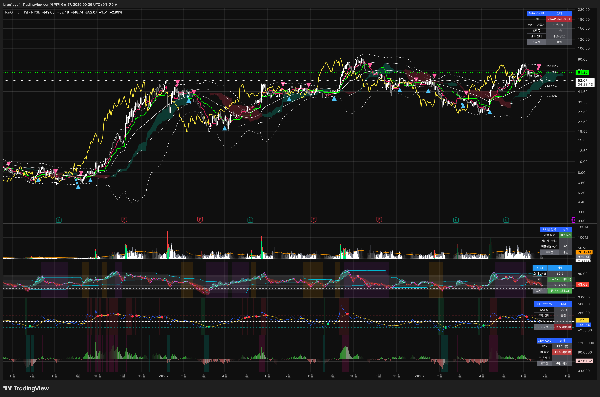

# KJH-Trading

이치모쿠 **추세추종 매수/매도 신호**를 메인으로 두고, 보조지표 5종의 **`포지션` 상태판**으로 그 신호가 믿을 만한지 한눈에 검증하는 트레이딩뷰 Pine Script 모음입니다.

*IonQ 차트에 이치모쿠(메인) + 보조지표 5종과 우측 상단 상태판을 함께 적용한 모습*

> 저장소: [`github.com/heum-junghwankim/KJH-Trading`](https://github.com/heum-junghwankim/KJH-Trading) · 전체 인덱스: [PineScript 가이드](https://github.com/heum-junghwankim/KJH-Trading/blob/main/pinescript/README.md)

---

## 구성

| 지표 | 역할 | 링크 |
| --- | --- | --- |
| **이치모쿠**(메인) | 추세추종 매수/매도 신호 | [인디케이터](https://github.com/heum-junghwankim/KJH-Trading/blob/main/pinescript/ICHIMOKU/advanced-ichimoku.pine) · [전략](https://github.com/heum-junghwankim/KJH-Trading/blob/main/pinescript/ICHIMOKU/advanced-ichimoku-strategy.pine) · [설명](https://github.com/heum-junghwankim/KJH-Trading/blob/main/pinescript/ICHIMOKU/README.md) |
| 거래량 압력 | 신호 봉에 추진력이 실렸나 | [README](https://github.com/heum-junghwankim/KJH-Trading/blob/main/pinescript/%EA%B1%B0%EB%9E%98%EB%9F%89%20%EC%95%95%EB%A0%A5%20%EC%B6%94%EC%A0%81/README.md) |
| cRSI | 국면(수축/확장)별 자리·다이버전스 | [README](https://github.com/heum-junghwankim/KJH-Trading/blob/main/pinescript/cRSI/README.md) |
| CCI | 극단 후 재진입 + 추세 추종 | [README](https://github.com/heum-junghwankim/KJH-Trading/blob/main/pinescript/CCI/README.md) |
| OBV-ADX | 추세 힘 / 휩쏘 1차 필터 | [README](https://github.com/heum-junghwankim/KJH-Trading/blob/main/pinescript/OBV-ADX/README.md) |
| Auto VWAP | 밴드워킹(추세) vs 지지·저항 | [README](https://github.com/heum-junghwankim/KJH-Trading/blob/main/pinescript/VWAP/README.md) |

---

## 1. 메인 신호 — 이치모쿠 (8 / 22 / 44 / 22)

두 조건이 **동시에** 충족될 때 신호가 발생합니다.

| 신호 | 조건 |
| --- | --- |
| **매수(롱)** | 후행스팬 강세(종가 > `displacement-1` 캔들 종가) **+** 전환선(8) 골든크로스(> 기준선 22) |
| **매도(숏)** | 위의 정확한 반대 (후행스팬 약세 + 전환선 데드크로스) |

- 같은 방향 신호는 반대 신호가 한 번 나온 뒤에만 다시 찍힘(중복 방지), 확정 직전 **후보 동그라미** 표시.
- ⚠️ 추세추종이라 **횡보장 휩쏘 / 후행성** 약점 → 그대로 믿지 말고 아래 상태판으로 검증.

---

## 2. 핵심 — 보조지표 `포지션` 상태판

각 지표는 차트 **우측 상단 상태판** 맨 아래에 **`롱 유리`(초록) / `숏 유리`(빨강) / `중립`(회색)** 을 한 가지로 표시합니다. 모든 지표가 같은 라벨을 씁니다.

### 지표별 `포지션` 판정 기준

| 지표 | `롱 유리` | `숏 유리` | `중립`(관망) |
| --- | --- | --- | --- |
| 거래량 압력 | 평균선 상회 + **매수 우세** | 평균선 상회 + **매도 우세** | 평균선 하회(추진력 약함) |
| cRSI | 확장+`LowBand`(과매도) / 확장+`상승 다이버전스` / 수축 후 `상단 돌파`(복귀 전 지속) | 확장+`HighBand`(과매수) / 확장+`하락 다이버전스` / 수축 후 `하단 돌파`(복귀 전 지속) | 수축 중 밴드 안 / 중앙 |
| CCI | 골든크로스(과매도 뒤) → 가격·CCI **동반 상승** 유지 | 데드크로스(과매수 뒤) → 가격·CCI **동반 하락** 유지 | 무장 / 신호선 이탈 |
| OBV-ADX | ADX 충분 + `+DI 우위` | ADX 충분 + `-DI 우위` | ADX 약함(휩쏘) |
| Auto VWAP | 수축 중 **양봉 상단 돌파**(워킹) / 확장+상승 `상단 밴드워킹` / 수축·평탄 `하단 지지` | 수축 중 **음봉 하단 돌파**(워킹) / 확장+하락 `하단 밴드워킹` / 수축·평탄 `상단 저항` | 중앙(공방) |

> 자세한 로직(다이버전스 종료, 돌파 지속, 밴드워킹 진입/종료 등)은 각 지표 README 참고.

### 신뢰도 판정

| 정렬 상태 | 해석 |
| --- | --- |
| 5개 `포지션` 모두 같은 방향 | **강한 신호** |
| 거래량·OBV-ADX 포함 3~4개 일치 | 보통 |
| 엇갈림 / `중립`·`휩쏘`·`과확장` 섞임 | **관망** |

---

## 3. 사용 방법

1. `Pine Editor`에 [이치모쿠 인디케이터](https://github.com/heum-junghwankim/KJH-Trading/blob/main/pinescript/ICHIMOKU/advanced-ichimoku.pine)를 올려 메인 신호를 띄웁니다.
2. 보조지표 5종을 추가해 상태판 `포지션`이 신호 방향으로 정렬되는지 확인합니다.
3. 수익률 검증은 [전략](https://github.com/heum-junghwankim/KJH-Trading/blob/main/pinescript/ICHIMOKU/advanced-ichimoku-strategy.pine)을 `Strategy Tester`에서 돌립니다.
