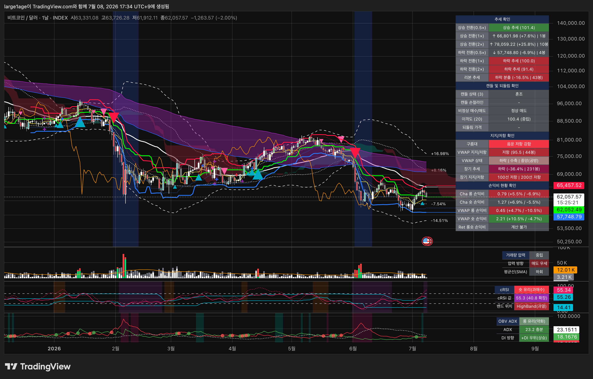

# KJH-Trading

**슈퍼 이치모쿠(메인·overlay)** 위에 **거래량 압력 · cRSI · OBV-ADX** 세 보조지표를 얹어, 하나의 신호가 아니라 **여러 지표가 한 방향으로 정렬됐는지 교차 검증**하는 트레이딩뷰 Pine Script 모음입니다.

핵심 원칙은 단순합니다 — **신호 하나를 믿지 않는다.** 이치모쿠 신호 + 우측 상단 테이블 + 보조지표 포지션이 같은 방향일 때만 자리로 봅니다.

> 저장소: [`github.com/heum-junghwankim/KJH-Trading`](https://github.com/heum-junghwankim/KJH-Trading)

| 지표 | 역할 | 링크 |
| --- | --- | --- |
| **슈퍼 이치모쿠**(메인) | 멀티스케일 매수/매도 신호 + 4섹션 종합 테이블 | [코드](./pinescript/SUPER-ICHIMOKU/advanced-ichimoku.pine) · [설명](./pinescript/SUPER-ICHIMOKU/README.md) |
| 거래량 압력 | 신호 봉에 추진력(매수/매도 우세)이 실렸는지 + 비정상 거래량 판정 | [설명](./pinescript/VOLUME-PRESSURE/README.md) |
| cRSI | 순환 평활 RSI · 동적 밴드 · 과매도/과열 · 다이버전스 | [설명](./pinescript/cRSI/README.md) |
| OBV-ADX | 추세 힘(ADX)·방향(DI)·과열 / 휩쏘 1차 필터 | [설명](./pinescript/OBV-ADX/README.md) |

> 이평선 리본과 Auto VWAP은 이치모쿠 인디케이터에 편입돼 테이블 행(`리본 추세`·`VWAP 지지/저항`·`VWAP 상태`·`장기 추세`)으로 내장됩니다. 보조지표는 각자 별도 스크립트로 각 창에 띄워 상태판을 볼 수도 있습니다.

---

## 1. 슈퍼 이치모쿠 (메인 · overlay)

정통 이치모쿠 계산(전환선 8 · 기준선 22 · 선행스팬B 44 · 후행 22) 위에 **멀티스케일 신호 · 트리거 테이블 · 휩쏘 필터 · 이격도**를 얹은 메인 인디케이터입니다. 차트 우측 상단에 **4개 섹션으로 묶인 종합 테이블**을 띄워, 추세·캔들·지지/저항·손익비를 한눈에 읽게 합니다. 신호는 단독 트리거가 아니라 **정렬 확인용**으로 설계됩니다.

### 매수/매도 신호 — 멀티스케일 + 확정 발화

두 조건이 **동시에** 충족될 때 신호가 발생합니다.

| 신호 | 조건① (래깅 스팬) | 조건② (컨버전 라인) |
| --- | --- | --- |
| **매수(롱)** ▲ | 종가가 기준선(22) 상향 돌파/이상 | 컨버전(8)이 기준선 상향 돌파/이상 |
| **매도(숏)** ▼ | 위의 정확한 반대 | 위의 정확한 반대 |

| 특성 | 동작 |
| --- | --- |
| 멀티스케일 | 같은 신호를 **0.5× / 1× / 2×** 세 스케일로 계산해 삼각형 **크기**(가장 작음/작음/보통)로 동시 표시. 여러 크기가 한 봉에 겹칠수록 시간축 정렬 → 신뢰↑ |
| 확정 발화(휩쏘 필터) | 트리거 충족 봉에서 즉시 안 찍고 **대기** → **다음 봉 종가가 트리거 가격을 유지할 때만** 그 봉에 발화(유지 못 하면 취소). 확정봉 종가 기준이라 **리페인팅 없음**, 1봉 지연 대신 속임수 돌파(휩쏘)를 거름 |
| 스케일 캐스케이드 | 상위 배수는 하위가 같은 방향 추세일 때만 — **1×는 0.5×가 추세 중**, **2×는 0.5×·1× 둘 다 추세 중**에 발화. 반대 신호가 나면 전제가 풀림 |
| 신호 순서 제한 | 같은 방향 신호는 반대 신호가 한 번 나온 뒤에만 다시 발생(중복 방지) |
| 모멘텀 모드 | 비정상 캔들/반등 감시 진입 시 기간을 한 단계 빠른 스케일로 시프트(0.5×→0.25× 등) → 더 빨리 반응. 이격도 중립 복귀 시 해제. 트리거 셀에 `M ` 접두 |

⚠️ 추세추종이라 **횡보장 휩쏘·후행성**이 약점 → 신호만 믿지 말고 아래 테이블·보조지표로 검증합니다.

### 신호 6모드 (택일 · 기본 `일반 확정 모드`)

`추세 매수/매도 신호` 입력 하나로 **신호 소스**(일반 도치안 / VWMA 거래량 가중)와 **확정 방식**(예측 / 확정)을 조합합니다. 한 번에 한 조합만.

| 모드 | 신호 소스 | 확정 방식 |
| --- | --- | --- |
| **`일반 확정 모드`**(기본) | 일반 도치안(컨버전·기준선) | 확정봉 종가 기준(1봉 지연·리페인팅 없음) |
| `일반 예측 모드` | 일반 도치안 | 예측(다음 봉 가정, 1봉 빨리·실시간 리페인팅) |
| `거래량 가중 확정 모드` | VWMA(거래량 가중) | 확정 |
| `거래량 가중 예측 모드` | VWMA | 예측 |
| `혼합 일반 모드` | **봉별 스위칭** — 비정상 거래량 봉=VWMA **즉시 발화**, 정상 봉=일반 도치안 | 정상 봉만 예측, 비정상 봉은 즉시 |
| `혼합 확정 모드` | 〃(봉별 스위칭) | 정상 봉만 확정, 비정상 봉은 즉시 |

> **혼합 모드의 핵심** — 그 봉이 **비정상 거래량**(`volume > SMA(volume,20) × 2`, VOLUME-PRESSURE와 동일 정의)이면 VWMA 신호를 **다음봉 확정 파이프라인을 우회해 그 봉에서 즉시 발화**합니다(장초·뉴스發 급변 빠른 캐치). 정상 봉은 기존 파이프라인(예측/확정)대로. 즉시 발화도 `dir≠방향`·스케일 캐스케이드를 공유해 **중복 발화는 구조적으로 차단**됩니다. 비정상 봉 트리거는 테이블 셀에 `V ` 접두.

### 우측 상단 테이블 — 4개 섹션

표는 좌열=항목·우열=값의 2열 구조이며, 관련 행을 **4개 섹션 병합 헤더**(딥 네이비 `#1B2A4A`·흰 글자)로 묶습니다. 아래 소섹션은 테이블 4섹션과 1:1로 대응합니다.

#### 1-1. 추세 확인

| 행 | 값 | 셀 색 |
| --- | --- | --- |
| `상승 전환`(0.5×/1×/2×) | 각 스케일 매수 신호가 나오려면 다음 봉 종가가 닿아야 할 **트리거 가격** `↑/↓ 가격 (현재가 대비 %) \| N봉`. 진행 중이면 `상승 추세 (기준선 이격도)`. 모멘텀=`M `·비정상거래량=`V ` 접두 | 근접(±2%)=둔탁 초록 · 진행 중=선명 초록 |
| `하락 전환`(0.5×/1×/2×) | 위의 매도 대칭. 진행 중이면 `하락 추세 (기준선 이격도)` | 근접=둔탁 빨강 · 진행 중=선명 빨강 |
| `리본 추세` | `횡보 수축 / 상승 분출 / 하락 분출 (이벤트 후 가격 % \| 몇 봉째)` — 현재봉 실시간 | **횡보 수축=순수 보라** `color.purple`(휩쏘 경계·관망) · 상승 분출=파랑 · 하락 분출=빨강 · 대기=회색 |

> `N봉` = **시간 조정 투영**. 현재가가 유지된다고 가정할 때 그 스케일 전환(도치안 전환선↔기준선 크로스)이 성립하기까지의 최소 봉수. horizon 내 미성립·데이터 부족이면 `-`, 진행 중이면 미표기. 미래참조 아님(과거 데이터로 미래 창을 투영)·리페인팅 없음. **가정 기반 참고치**(실제 미래가는 변함).

#### 1-2. 캔들 및 되돌림 확인

| 행 | 값 | 셀 색 |
| --- | --- | --- |
| `캔들 상태 (3)` | 최근 **3봉을 7분류**로 스코어링해 `분류명 \| 근거패턴`. **표시 전용**(신호 미연결). 현재봉 캔들 바디도 이 색으로 칠함(혼조 제외) — **[캔들 색 표시 조건] 3옵션 AND 게이트**(추세신호수·리본·되돌림) 모두 만족 시에만 색 표시(셀 색은 게이트와 무관하게 항상 유지) | 7분류 색(아래) |
| `캔들 손절라인` | 캔들 상태 **바로 아래**. 7분류 방향 재사용 — **하락 계열=3봉 최고점** `S +금액 (+N%)`, **상승 계열=3봉 최저점** `L -금액 (-N%)`, 혼조=`-`. 3봉 극점 기준 스톱 후보가(**표시 전용**·진입 로직 무관) | 캔들 상태와 동일(혼조=회색) |
| `비정상 매수/매도` | cRSI 과열 + 볼린저 이탈(고/저가 기준) → `비정상 매수/매도`, 이후 반등 감시 `롱/숏 감시(강)`. 병기 `비정상 매수 \| 숏 감시`. 정상이면 양봉=`정상 매수`·음봉=`정상 매도`. 정상 복귀=이격도 중립 | 롱 감시=초록·강화=파랑 · 숏 감시=주황·강화=빨강 · 비정상 매도=아쿠아·비정상 매수=빨강 · 정상=회색 |
| `이격도 (N)` | 종가÷MA×100(기준 100) `값 (상태)`. 고정 임계+적응형(σ) 중 1개=`되돌림 주의`(둔탁)·2개=`되돌림 확실`(선명)·0개=`중립` | 과열=빨강계·과매도=초록계·확실=선명·주의=둔탁·중립=회색 |
| `되돌림 가격` | 이격도가 중립으로 복귀하는 목표가 `가격 (현재가 대비 %)`. 중립이면 `-` | 회색 |

**캔들 상태 7분류** (약세→강세, 표시 전용):

| 분류 | 의미 | 셀 색 |
| --- | --- | --- |
| `하락 진행` | 3봉이 저점을 쌓으며 순몸통 임계 이상 하락 지속 | 선명 빨강 `color.red` |
| `추세형 하락 예측` | 선행 하락 방향 2봉 저점 돌파형 강봉(지속 예측) | 둔한 빨강 `#A57A7A` |
| `반전형 하락 예측` | 상승 흐름에서 반전 패턴(장악·유성·석별 등) | 밝은 빨강 `#EF5350` |
| `혼조` | 데이터 부족·변동성 부족·미매칭 | 회색 `color.gray` |
| `반전형 상승 예측` | 하락 흐름에서 반전 패턴(장악·망치·샛별 등) | 청록 `#26A69A` |
| `추세형 상승 예측` | 선행 상승 방향 2봉 고점 돌파형 강봉(지속 예측) | 둔한 녹색 `#6E8F72` |
| `상승 진행` | 3봉이 고점을 쌓으며 순몸통 임계 이상 상승 지속 | 선명 녹색 `color.green` |

> 판정 순위 = **반전형 예측 → 진행 → 추세형 예측**(추세 꺾임을 먼저 알림). ⚠️ 임계·예측 방향은 **백테스트 검증 전 관찰용**입니다.

> **캔들 색 표시 조건(AND 게이트)** — 현재봉 캔들 바디 색칠(`barcolor`)은 **[캔들 색 표시 조건]** 3옵션(① 동일 방향 추세신호 최소 개수(기본 2) · ② 리본 추세 조건(기본 무관) · ③ 되돌림 상태 조건(기본 무관))을 **모두 만족(AND)** 할 때만 노출됩니다. 교차검증 정렬 시에만 캔들 색을 보여 신뢰도를 높입니다. **표시 전용** — 캔들 7분류·바색 색값·테이블 셀 색은 무변경(셀 색은 항상 유지). 자세한 정의는 [SUPER-ICHIMOKU README](pinescript/SUPER-ICHIMOKU/README.md#캔들-색-표시-조건--교차검증-정렬-and-게이트표시-전용) 참조.

#### 1-3. 지지/저항 확인

| 행 | 값 | 셀 색 |
| --- | --- | --- |
| `구름대` | 지그재그(스윙) 레그가 구름에 **근접**(경계 ±ATR 배수 이내)할 때만 — 구름 위+하락 레그+근접=`지지`, 구름 아래+상승 레그+근접=`저항`. 앞에 양운/음운 접두, 강도 `약함/보통/강함` | 지지=녹(약 `#6E8F72`·보통 `#3E9142`·강 초록) · 저항=빨강(약 `#A57A7A`·보통 `#B14A4A`·강 빨강) · 맥락=위치×구름색 방향색 |
| `VWAP 지지/저항` | VWAP 위=`지지`·아래=`저항` + `(이격도 \| 유지 봉수)`. 이격도=종가÷VWAP×100, ±2σ 밖이면 둔탁색 | 지지=초록·저항=빨강(과이격=둔탁) |
| `VWAP 상태` | `기울기(상승/하락/평탄) \| 밴드폭(확장/수축/유지) \| 밴드 상태`. 밴드워킹이면 `밴드워킹`으로만(방향은 셀 색), 그 외 `하단 지지/상단 저항`·`중앙(공방)` | 상승=녹(밴드워킹 선명·그외 둔탁) · 하락=빨강(밴드워킹 선명·그외 둔탁) · 평탄=밴드 상태별 · 중앙=회색 |
| `장기 추세` | MA100·200 기반 8종 `골든/데드 크로스`·`(강한/약한) 상승·하락` + `(크로스 후 MA100 변화% \| 봉수)` | **상승계열=청록 `#0E9C8A`** · **하락계열=자홍 `#C2185B`**(리본 순수 보라와 구분). 강함=선명·약함=옅음·크로스=선명 |
| `장기 지지/저항` | `100선 지지/저항 \| 200선 지지/저항`(몸통이 MA를 완전히 이탈해야 지지/저항, 걸치면 중립) | 둘 다 지지=파랑·둘 다 저항=빨강·엇갈림=둔탁 |

#### 1-4. 손익비 현황 확인

기준별로 **독립 3계열**. 진입=현재 종가.

| 행 | 기준 · 계산 | 셀 색 |
| --- | --- | --- |
| `Cha 롱/숏` | **청산선 기준(주 손익비)**. RR = 반대편 청산선까지 목표 ÷ 같은편 청산선까지 손절. 청산선 범위 밖이면 `계산 불가` | ≥1.5 유리 초록 · ≥1.0 중립 회색 · <1 불리 빨강 · 계산불가 회색 |
| `VWAP 롱/숏` | **VWAP선·밴드2 기준**. VWAP 위/아래 양쪽 계산(regime 기준선). `계산 불가`는 밴드2 이탈 시에만 | Cha와 동일(≥1.5 초록·≥1.0 회색·<1 빨강·계산불가 회색) |
| `Ret 롱숏` | **되돌림 가격 기준**. 목표=되돌림 가격. 손절=순수 E(이격 바깥 엣지) 우선 + 계산불가 시 고정손절 폴백(주의 −2%·확실 −4%). `L`=과매도 롱·`S`=과열 숏. 되돌림 주의/확실이면 항상 계산됨 | **별도 등급**: RR≥5 녹색 · 3~5 둔탁녹 `#6E8F72` · <3·계산불가 회색 |

> 스윕(점선)·청산(직선) 트레일은 차트 라인·가격축 라벨로 표시됩니다(테이블 행 없음 — 손익비 계산엔 청산선 사용).

---

## 2. 거래량 압력 지표

현재 봉의 `매수 우세 / 매도 우세`를 **종가 위치**로 추정하고, `비정상 거래량`과 `평균선(SMA)`을 함께 보는 압력 확인 도구입니다.

| 요소 | 계산 · 의미 |
| --- | --- |
| Buy/Sell 추정 | `buyVolume = volume × (close−low)/(high−low)`, sell은 대칭. 체결 델타가 아니라 **종가 위치 기반 추정치** |
| 비정상 거래량 | `volume > SMA(volume, N) × (1 + 배수)`. 기본 `N=20`·`배수=1.0`(=평균의 **2배 초과**) |
| 평균선(SMA) | `SMA(volume, 봉수)` — 현재 거래량이 평소보다 실제로 큰지 확인 |

**우측 상단 포지션**

| 포지션 | 판정 |
| --- | --- |
| `롱 유리`(초록) | 평균선 **상회** + 매수 우세 |
| `숏 유리`(빨강) | 평균선 **상회** + 매도 우세 |
| `중립`(회색) | 평균선 **하회**(방향은 있어도 추진력 약함 → 관망) |

> 비정상 거래량은 포지션을 가르지 않고 `압력 방향` 셀에 녹여 표기합니다 — **비정상이면 셀 색 진하게**, 일반은 연한 색으로 강도 구분.

---

## 3. cRSI 지표 (RSI Cyclic Smoothed)

기본 RSI에 **지배 사이클 기반 평활**과 **동적 과매수/과매도 밴드**를 더한 버전입니다. 고정 `30/70` 대신, 최근 사이클 구간에서 cRSI가 실제로 머문 범위로 밴드를 그려 "지금 국면 기준으로 과한지"를 봅니다.

| 요소 | 의미 |
| --- | --- |
| cRSI(노랑 선) | 사이클 평활 RSI 본선 |
| cMFI(파랑 선) | 동일 주기·평활 파이프라인에 MFI(자금 흐름) 입력 — cRSI와 정렬 확인용 교차 검증선 |
| HighBand(빨강)/LowBand(초록) | 사이클 메모리 구간에서 백분위(상·하위 10%)로 잡은 동적 과매수/과매도 경계(가격축 라벨 표시) |
| 밴드폭 배경 | **좁음=진한 주황(수축)**, **넓음=보라(확장)** — 변동성/사이클 진폭 대리 |

**우측 상단 포지션** (판정 우선순위)

| 포지션 | 판정 |
| --- | --- |
| `롱 유리` | 수축 후 상단 돌파 지속 / 확장 상승 다이버전스 / `LowBand`(과매도) |
| `숏 유리` | 수축 후 하단 돌파 지속 / 확장 하락 다이버전스 / `HighBand`(과열) |
| `중립` | 수축 중 밴드 안 / 중앙 |

> 기본 `Dominant Cycle = 20`(RSI 길이 10·사이클 메모리 40으로 환산). 원작: Lars von Thienen, *Decoding The Hidden Market Rhythm*(2017) Ch.4 (CC BY 4.0).

---

## 4. OBV-ADX 지표

`OBV` 기반 `+DI / −DI / ADX` 구조에, 고정 임계 대신 **`DI Difference`의 z-score 극단값**으로 `낙폭과대`/`초과매수`를 배경으로 보여주는 버전입니다.

| 요소 | 의미 |
| --- | --- |
| `+DI / −DI / ADX` | OBV 변화량 기반 방향성·강도 (기본 `+DI=파랑`·`−DI=주황`·`ADX=빨강`) |
| 낙폭과대(녹 배경) | `diDiffZScore ≤ −Oversold Z` + `ADX ≥ 최소` |
| 초과매수(빨 배경) | `diDiffZScore ≥ Overbought Z` + `ADX ≥ 최소` |

**우측 상단 포지션**

| 포지션 | 판정 |
| --- | --- |
| `롱 유리`(강화/약화) | ADX 충분 + `+DI 우위`. **강화**=OBV 방향 에너지 증가(선명), **약화**=소진 중(둔탁) |
| `숏 유리`(강화/약화) | ADX 충분 + `−DI 우위` |
| `중립(휩쏘)` | ADX 약함(추세 힘 없음 → 관망, 1차 필터) |

> `ADX` 행에 값 + `충분/약함`, 과열이면 `(과열)` 접미. 셀 색은 DI 방향(초록/빨강)·충분=선명·약함=둔탁, **과열 구간은 과열측 색으로 덮어씀**(롱측 `#6E8F72`·숏측 `#A57A7A`). 기본 `DI Length=20`·`ADX Smoothing=20`.

**보조지표 정렬 = 신뢰도** — 거래량 압력·cRSI·OBV-ADX 포지션이 이치모쿠와 같은 방향으로 모일수록 신뢰↑. 엇갈리거나 `중립/휩쏘`가 섞이면 관망.

---

## 5. 매매 전략

> 교육·리서치 목적의 **시스템 규칙**(정렬·국면·손익비) 서술입니다. 특정 종목 추천·투자 권유가 아닙니다.

진입 전 반드시 `VWAP 상태`·`이격도`·`손익비`로 지금이 어느 국면인지부터 구분합니다.

### 5-1. 추세 롱/숏 포지션 (정렬 확인 진입)

**추세 국면**에서 이치모쿠 + 테이블 + 보조지표가 한 방향으로 정렬됐을 때만 그 방향으로 진입합니다.

| 체크 | 롱 | 숏 |
| --- | --- | --- |
| VWAP 상태 | 밴드워킹(상단)·상승 기울기 | 밴드워킹(하단)·하락 기울기 |
| 이치모쿠 신호 | 매수 삼각형(캐스케이드 붙으면 신뢰↑) | 매도 삼각형 |
| 장기 추세 | **같은 방향**(청록) | **같은 방향**(자홍) |
| 보조지표 정렬 | 3개 이상 `롱 유리`(특히 OBV-ADX `강화`) | 3개 이상 `숏 유리` |
| 손익비 | `Cha`(청산선) 확보 · 밴드워킹 되돌림이면 `VWAP` 참고 | 동일 |
| 손절 / 목표 | VWAP·롱 청산선 / 반대편 청산선 | VWAP·숏 청산선 / 반대편 청산선 |

> 큰 흐름(`장기 추세`)을 거스르지 않는다. 밴드워킹이 꺾이면(밴드폭 확장→수축·밴드워킹 이탈) 청산.

### 5-2. 역추세 되돌림 롱/숏 포지션 (⚠️ 고난이도)

**과매도/과열이 평균으로 되돌아오는 것**을 노립니다. 승률은 낮아도 손익비로 이깁니다.

⚠️ **역추세는 난이도가 높아 "쌀 조건"(과매도/과열)만으로 진입 금지.** "가격이 싸다"는 진입 근거가 아닙니다. 추세가 그대로 이어지면 계속 물립니다. 반드시 아래 **반등 확인 게이팅 — 2개 이상 정렬**을 통과해야 진입합니다.

| 반등 확인 게이트(2개 이상) | 신호 |
| --- | --- |
| cRSI | 밴드 하단(상단) 돌파 **해제**(밴드 안으로 복귀) 또는 다이버전스 |
| OBV-ADX | DI 역전(`−DI 우위`→`+DI 우위` 등) 또는 `약화`(추세 소진) |
| VWAP | 하단 지지 확인 / 상단 저항 돌파 |
| 이치모쿠·캔들 | 반등 감시(`롱/숏 감시`) + 반전형 캔들, 구름대 지지/저항 강함 도달 |

| 항목 | 롱(과매도 되돌림) | 숏(과열 되돌림) |
| --- | --- | --- |
| 국면 | 이격도 `되돌림 확실` + 하단 이탈 | 이격도 `되돌림 확실` + 상단 이탈 |
| 진입 | **쌀 조건 + 반등 확인 2개 이상** | 동일 |
| 손익비 | **`Ret` RR 확보**(목표=되돌림 가격) — RR이 낮으면 진입 안 함 | 동일 |
| 손절 | 극단 방향 청산선 바로 너머(반전 실패=추세 지속→빠른 손절) | 동일 |
| 목표 | 되돌림 가격 → VWAP → 반대편 밴드 분할 청산 | 동일 |

> **자본 보존 우선.** 손익비(R:R)가 확보되지 않으면 진입하지 않습니다. 손익비 기준값은 **잠정**이며 알고리즘 수학자의 백테스트로 확정합니다. 역추세는 반드시 손절 기준을 먼저 정하고 방아쇠를 당깁니다.

---

## 6. 매매 철학

| 원칙 | 내용 |
| --- | --- |
| **단일 신호 불신** | 신호 하나를 믿지 않는다 — 이치모쿠 + 테이블 + 보조지표가 한 방향으로 정렬됐는지 교차 검증한다 |
| **자본 보존 우선** | 얼마 벌지보다 얼마 잃을지를 먼저 정한다. 살아남으면 기회는 다시 온다 |
| **국면 규정** | 추세/횡보/역추세 중 지금이 어느 국면인지 먼저 규정하고, 국면에 맞는 방식으로만 매매한다 |
| **R:R 미확보 진입 배제** | 손익비(R:R)가 확보되지 않은 자리엔 진입하지 않는다 |
| **비대칭 베팅** | 확신이 아니라 확률로 베팅한다. 틀리면 작게 잃고 맞으면 크게 먹는다 — 그 비대칭이 전부다 |
| **기다림도 매매** | 자리가 아니면 관망이 최선의 포지션이다. 시장이 시나리오를 부정하면 시장이 아니라 나를 의심하고 물러난다 |

> 이치모쿠 백테스트 전략(자동매매) 스크립트는 추후 다시 추가될 예정입니다.
