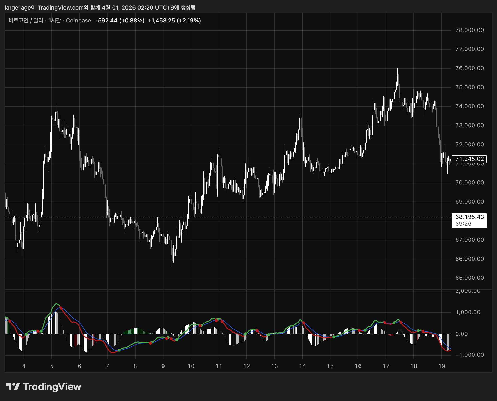
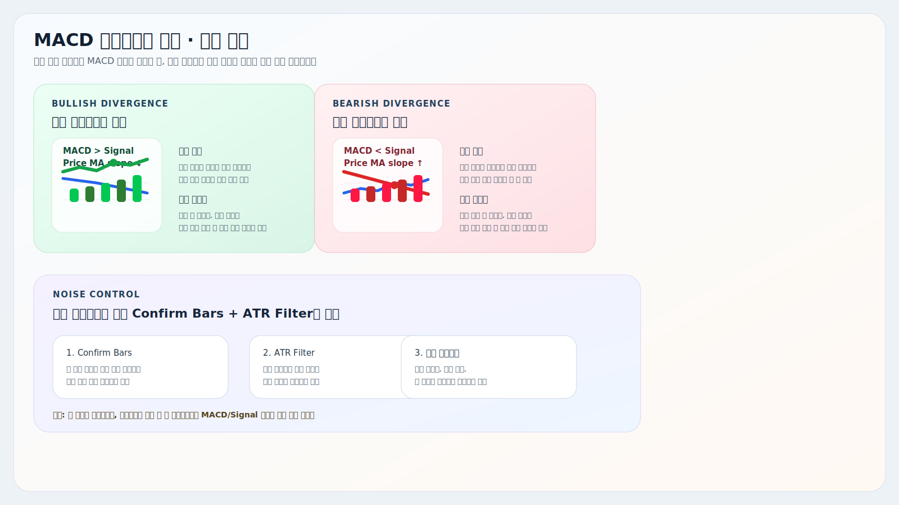
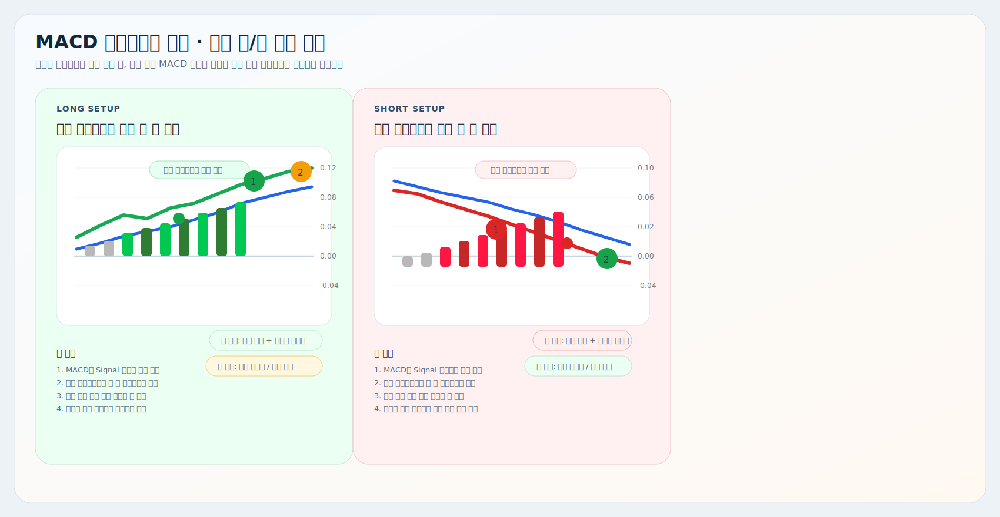

# MACD 다이버전스 추적

트레이딩뷰용 Pine Script 보조지표 설명서입니다.

대상 스크립트:
- [`macd-divergence-tracker.pine`](./macd-divergence-tracker.pine)

이 지표는 기본 `MACD / Signal / Histogram` 구조에 `가격 이평 기울기`와 `ATR 필터`를 얹어서, 일반 MACD보다 `모멘텀 재개`와 `다이버전스 후보`를 더 빨리 읽기 쉽게 만든 버전입니다.

## 예시와 요약 이미지

## 핵심 구조

| 요소 | 현재 코드 기준 역할 |
| --- | --- |
| MACD 선 | `Fast Length`와 `Slow Length` 차이로 현재 방향을 봅니다. |
| Signal 선 | MACD 기준선 역할을 하며, 크로스 타이밍 판단에 씁니다. |
| Histogram | `MACD - Signal`을 triple EMA로 한 번 더 부드럽게 만든 값입니다. |
| 다이버전스 강조색 | `MACD 방향`과 `가격 MA 기울기`가 반대로 움직일 때만 히스토그램 색을 바꿉니다. |
| 크로스 원 | MACD와 Signal의 실제 교차 시점을 원으로 표시합니다. |

## 현재 로직

### 1. 기본 계산

- `MACD = fast MA - slow MA`
- `Signal = MACD의 이동평균`
- `Histogram = MACD - Signal`을 triple EMA smoothing 한 값

즉 MACD와 Signal은 원형 구조를 유지하고, 히스토그램만 더 부드럽게 만든 형태입니다.

### 2. 다이버전스 후보 조건

현재 코드는 `가격 이동평균 기울기`와 `MACD 방향`이 어긋날 때만 다이버전스 후보 색을 켭니다.

강세 후보:
- `MACD > Signal`
- 가격 MA가 `Confirm Bars` 동안 실제로 하락
- 하락 폭이 `ATR Filter` 이상

약세 후보:
- `MACD < Signal`
- 가격 MA가 `Confirm Bars` 동안 실제로 상승
- 상승 폭이 `ATR Filter` 이상

즉 이 지표에서 말하는 다이버전스는 `클래식 피벗 다이버전스`가 아니라, `가격 이평 기울기와 내부 모멘텀 방향의 어긋남`을 강조하는 방식입니다.

### 3. 크로스 조건

기본 크로스:
- `MACD`가 `Signal` 위로 돌파하면 상승 크로스
- `MACD`가 `Signal` 아래로 이탈하면 하락 크로스

추가 필터 크로스:
- 상승 크로스이면서 `MACD > 0`
- 하락 크로스이면서 `MACD < 0`

코드 안에는 이 조건으로 `alert()` 호출도 들어 있습니다.

## 차트 읽는 법

| 상황 | 해석 |
| --- | --- |
| `MACD > Signal` | 기본 방향이 위쪽입니다. |
| `MACD < Signal` | 기본 방향이 아래쪽입니다. |
| 초록 계열 히스토그램 강조 | 가격 이평은 눌리는데 내부 모멘텀은 아직 위쪽인 상태입니다. |
| 빨강 계열 히스토그램 강조 | 가격 이평은 반등하는데 내부 모멘텀은 아직 아래쪽인 상태입니다. |
| 크로스 원 | 실제 타이밍 확인용입니다. 방향 판단은 선 관계와 히스토그램을 먼저 봅니다. |

실전에서는 보통 이렇게 읽으면 됩니다.

- `MACD > Signal + 초록 히스토그램`: 눌림 뒤 재상승 후보
- `MACD < Signal + 빨강 히스토그램`: 반등 뒤 재하락 후보
- `흰색/회색 히스토그램`: 일반 확장/축소 구간

## 자주 조정하는 설정

| 설정 | 언제 조정하나 |
| --- | --- |
| `Fast Length`, `Slow Length`, `Signal Smoothing` | MACD 자체 반응 속도를 바꾸고 싶을 때 |
| `Price MA Length` | 가격 기울기 기준을 더 짧게/길게 보고 싶을 때 |
| `Histogram TRIX Smoothing` | 히스토그램을 더 부드럽게 또는 더 민감하게 만들 때 |
| `Divergence Confirm Bars` | 다이버전스 색이 너무 자주 튈 때 |
| `Divergence ATR Filter` | 미세한 기울기 흔들림을 더 강하게 걸러내고 싶을 때 |
| `Histogram Scale` | 히스토그램을 더 크게 또는 작게 보고 싶을 때 |
| `Show Circle on Cross` | 원형 타이밍 표시를 켜거나 끌 때 |
| `Indicator TimeFrame` | 다른 타임프레임 기준 MACD를 보고 싶을 때 |

## 같이 쓰는 방법

1. [`비정상 가격 추적 (캔들)`](../비정상%20가격%20추적%20(캔들)/README.md)에서 자리와 진입 후보를 먼저 확인합니다.
2. [`Auto VWAP`](../VWAP/README.md)으로 평균 단가 위/아래 위치를 확인합니다.
3. [`거래량 압력 추적`](../거래량%20압력%20추적/README.md)으로 실제 압력이 같은 방향인지 봅니다.
4. 마지막으로 이 MACD에서 `히스토그램 강조 + 크로스`가 붙는지 확인합니다.

한 줄로 줄이면:

- `캔들`은 자리
- `VWAP`은 기준 단가
- `거래량`은 압력
- `MACD`는 힘 재개 확인

## 해석 팁

- 이 지표는 `단독 진입기`보다 `모멘텀 재개 확인기`에 가깝습니다.
- 원 하나보다 `선 관계 + 히스토그램 강조 + 유지 시간`을 같이 봐야 해석이 안정적입니다.
- `Histogram Scale`은 시각 크기만 바꾸고, 계산 로직은 바꾸지 않습니다.
- `Confirm Bars`와 `ATR Filter`를 너무 낮추면 색이 자주 튀고, 너무 높이면 전환이 늦어집니다.

## 주의사항

- 여기서 말하는 다이버전스는 `가격 MA 기울기`와 `MACD 방향`의 어긋남입니다.
- 히스토그램은 triple EMA smoothing이 들어가므로 일반 MACD보다 반응이 약간 늦을 수 있습니다.
- 멀티타임프레임을 쓰면 현재 차트 봉과 계산 봉의 체감이 달라질 수 있습니다.
- MACD 방향이 좋아 보여도 가격 구조나 거래량이 따라오지 않으면 신뢰도는 낮아집니다.
