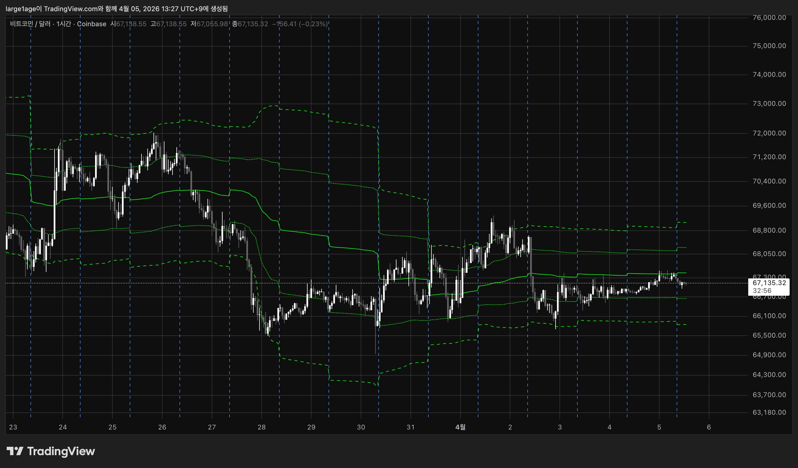
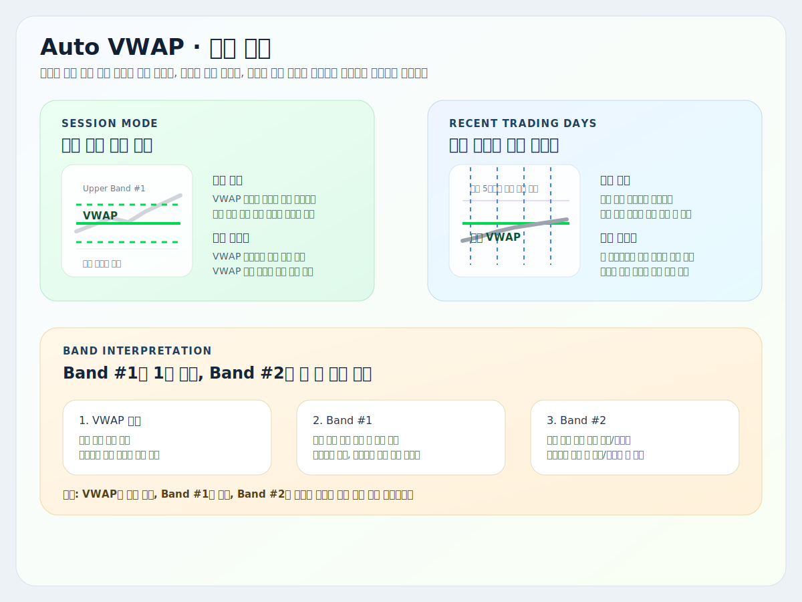
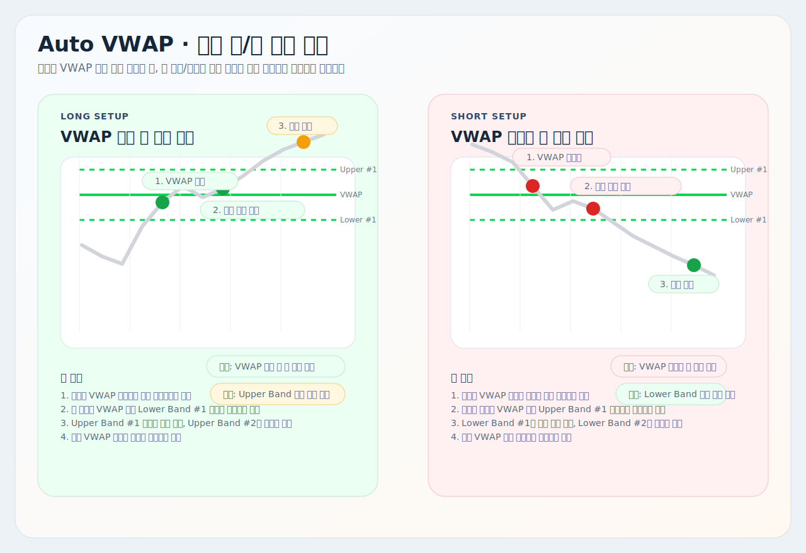

# Auto VWAP

트레이딩뷰용 Pine Script 오버레이 지표 설명서입니다.

대상 스크립트:
- [`auto-vwap.pine`](./auto-vwap.pine)

이 지표는 `현재 세션 기준 VWAP`과 `최근 N거래일 기준 VWAP`를 한 스크립트에서 바꿔 볼 수 있게 만든 버전입니다. 핵심은 `평균 체결 단가가 어디인지`, 그리고 `현재 가격이 그 기준에서 얼마나 멀리 벗어났는지`를 빠르게 읽는 데 있습니다.

## 예시와 요약 이미지

## 핵심 구조

| 요소 | 현재 코드 기준 역할 |
| --- | --- |
| VWAP | 선택한 기준 구간의 거래량 가중 평균 단가 |
| Band #1 | VWAP 대비 1차 확장 구간 |
| Band #2 | VWAP 대비 2차 확장 구간 |
| Session 모드 | 현재 세션만 표시 |
| Recent Trading Days 모드 | 최근 `N`거래일 누적 구간을 하나로 묶어 계산 |

## 현재 로직

### 1. 기준 구간

`Anchor Mode`에 따라 기준이 바뀝니다.

`Session`
- 현재 세션만 보여줍니다.
- 이전 세션 선은 남기지 않습니다.

`Recent Trading Days`
- 최근 `N`거래일을 하나의 누적 구간처럼 계산합니다.
- 새 거래일이 열리면 가장 오래된 하루가 빠지고 최근 하루가 추가됩니다.

### 2. VWAP 계산

현재 코드는 아래 값을 누적해서 씁니다.

- `src * volume`
- `volume`
- `src^2 * volume`

이 누적값으로:
- `VWAP`
- 거래량 가중 분산
- 표준편차 기반 밴드

를 계산합니다.

### 3. 밴드 계산 방식

`Bands Calculation Mode`는 두 가지입니다.

`Standard Deviation`
- 거래량 가중 표준편차를 밴드 폭으로 사용합니다.

`Percentage`
- `VWAP * 1%`를 기본 폭으로 보고 배수를 곱합니다.

## 차트 읽는 법

| 상황 | 해석 |
| --- | --- |
| 가격이 VWAP 위 | 선택한 기준 구간 평균 단가보다 위에서 거래 중 |
| 가격이 VWAP 아래 | 선택한 기준 구간 평균 단가보다 아래에서 거래 중 |
| VWAP 근처 왕복 | 방향보다 평균 단가 공방이 진행 중 |
| Band #1 접근 | 정상 확장 또는 첫 과열 구간 |
| Band #2 접근 | 강한 확장 또는 과열/과매도 구간 |

실전에서는 보통 이렇게 읽으면 됩니다.

- `VWAP 회복 후 유지`: 기준 단가 재장악
- `VWAP 아래 반등 실패`: 기준 단가 회복 실패
- `Band #1`: 추세 확장 확인
- `Band #2`: 과확장 감시

`Band #2` 바깥 자체가 바로 반전은 아닙니다. 강한 추세에서는 바깥 체류가 이어질 수 있습니다.

## 모드별 사용 감각

| 모드 | 언제 쓰나 |
| --- | --- |
| `Session` | 당일 장중 기준 단가를 볼 때 |
| `Recent Trading Days` | 최근 며칠 비용대와 스윙 기준선을 볼 때 |

짧게 보면:

- `Session`은 오늘 평균 단가
- `Recent Trading Days`는 최근 비용대

## 자주 조정하는 설정

| 설정 | 언제 조정하나 |
| --- | --- |
| `Anchor Mode` | 당일 기준과 최근 며칠 기준을 바꾸고 싶을 때 |
| `Recent Trading Days` | 스윙 기준 범위를 넓히거나 줄일 때 |
| `Source` | 기준 가격을 `hlc3`, `close` 등으로 바꾸고 싶을 때 |
| `Bands Calculation Mode` | 표준편차형 밴드와 퍼센트형 밴드를 바꾸고 싶을 때 |
| `Bands Multiplier #1`, `#2` | 확장 폭을 더 넓게 또는 좁게 보고 싶을 때 |
| `Hide VWAP on 1D or Above` | 일봉 이상에서 선을 숨기고 싶을 때 |

## 같이 쓰는 방법

1. [`비정상 가격 추적 (캔들)`](../비정상%20가격%20추적%20(캔들)/README.md)에서 자리와 기준 봉/후보 흐름을 먼저 봅니다.
2. 이 VWAP으로 현재 가격이 기준 단가 위인지 아래인지 확인합니다.
3. [`거래량 압력 추적`](../거래량%20압력%20추적/README.md)으로 실제 압력이 같은 방향인지 확인합니다.
4. [`MACD`](../MACD/README.md)로 모멘텀 재개 여부를 마지막에 확인합니다.

예시:

- 롱: 자리 형성 + VWAP 회복 + 매수 압력 확인 + MACD 재가속
- 숏: 자리 형성 + VWAP 재이탈 + 매도 압력 확인 + MACD 재하락

## 해석 팁

- VWAP은 `방향 예측선`이 아니라 `기준 단가`입니다.
- Band #1은 확장 확인, Band #2는 과확장 감시에 더 가깝습니다.
- `Session`에서 좋던 흐름이 `Recent Trading Days` 기준으로는 아직 저항 아래일 수 있으니, 두 모드는 역할이 다릅니다.
- VWAP을 한두 번 찍는 것보다 `회복 후 유지`, `이탈 후 재진입 실패`가 더 중요합니다.

## 주의사항

- 이 지표는 거래량 데이터가 있어야 정상 동작합니다. 코드에는 거래량이 없을 때 `runtime.error`도 들어 있습니다.
- `Session` 모드는 의도적으로 현재 세션만 보여줍니다.
- `Recent Trading Days`는 달력 일수가 아니라 실제 거래일 기준입니다.
- 저유동 종목에서는 VWAP과 밴드 반응이 더 거칠 수 있습니다.
