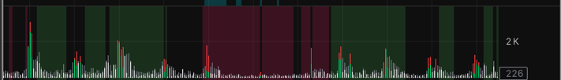
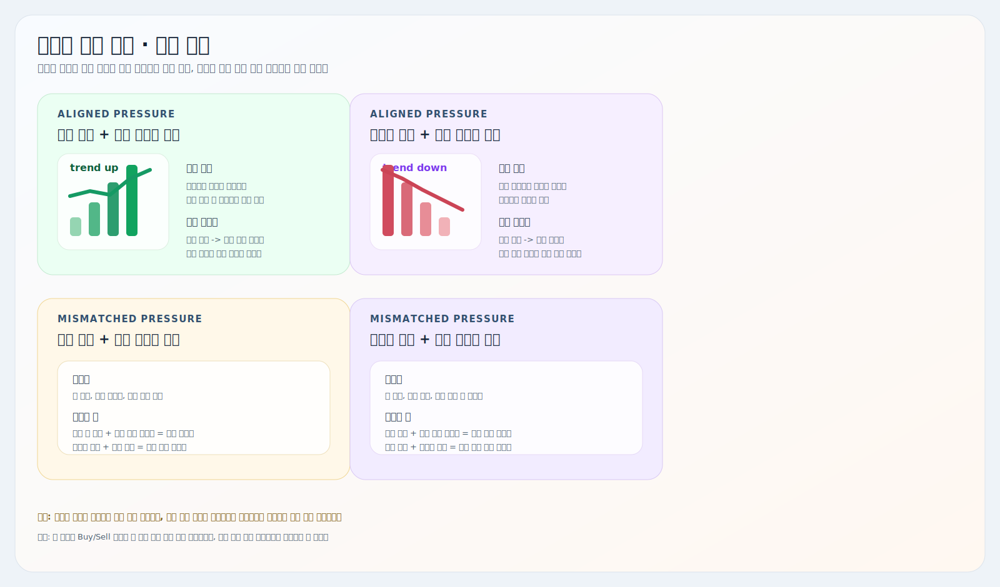
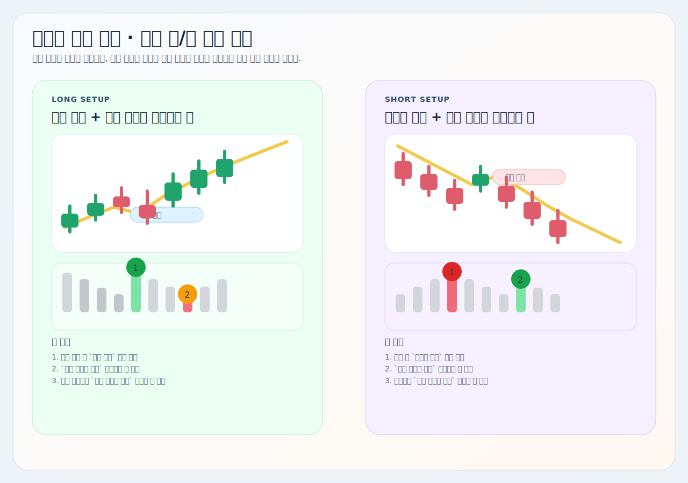

# 거래량 압력 추적

트레이딩뷰용 Pine Script 지표 설명서입니다.

대상 스크립트:
- [`volume-pressure-tracker.pine`](./volume-pressure-tracker.pine)

이 지표는 현재 봉의 `매수 우세 / 매도 우세`를 종가 위치 기반으로 추정해서, `비정상 거래량`과 `전체 거래량 평균선`을 함께 보는 간단한 압력 확인 도구입니다.

## 예시와 요약 이미지

## 핵심 구조

| 요소 | 현재 코드 기준 역할 |
| --- | --- |
| Buy Volume 추정치 | 봉의 종가가 고가에 가까울수록 크게 계산됩니다. |
| Sell Pressure 배경 막대 | 전체 거래량을 매도 계열 색으로 먼저 깔아 압력 바탕을 보여줍니다. |
| 비정상 거래량 색상 | 최근 평균 대비 강한 봉만 따로 강조합니다. |
| Total Volume SMA | 현재 거래량이 최근 평균보다 큰지 보는 기준선입니다. |

## 현재 로직

### 1. Buy / Sell 압력 추정

현재 코드는 아래 식을 씁니다.

- `buyVolume = volume * (close - low) / (high - low)`
- `sellVolume = volume * (high - close) / (high - low)`

즉 실제 체결 델타가 아니라, `봉 안에서 종가가 어디에 위치했는가`를 이용한 추정치입니다.

### 2. 비정상 거래량 조건

비정상 거래량은:

- `volume > sma(volume, 비교 캔들 수) * (1 + 비정상 배수)`

일 때만 켜집니다.

기본값은:
- `비교 캔들 수 = 20`
- `비정상 배수 = 1.0`

즉 기본 기준으로는 최근 평균보다 `100%` 이상 큰 봉만 비정상으로 봅니다.

### 3. 평균선

`Total Volume SMA`는:

- `sma(volume, 평균선 봉 수)`

로 계산합니다. 이 선 위로 거래량이 올라오면, 현재 봉 압력이 `평소보다 실제로 큰지` 확인하는 데 쓸 수 있습니다.

## 차트 읽는 법

| 상황 | 해석 |
| --- | --- |
| 흰색/연두 계열 우세 | 매수 압력이 상대적으로 강한 봉 |
| 회색/빨강 계열 우세 | 매도 압력이 상대적으로 강한 봉 |
| 비정상 색상 활성 | 최근 평균보다 강한 체결이 붙은 봉 |
| 평균선 상회 | 현재 거래량이 최근 평균보다 큼 |

실전에서는 보통 이렇게 읽으면 됩니다.

- `비정상 매수 + 평균선 상회`: 눌림 뒤 매수 압력 확인
- `비정상 매도 + 평균선 상회`: 반등 뒤 매도 압력 확인
- `방향은 있는데 평균선 아래`: 힘이 약한 신호

## 같이 쓰는 방법

1. [`비정상 가격 추적 (캔들)`](../비정상%20가격%20추적%20(캔들)/README.md)에서 자리와 진입 후보를 먼저 봅니다.
2. 이 거래량 지표에서 같은 봉 또는 근처 봉에 비정상 압력이 붙는지 확인합니다.
3. [`Auto VWAP`](../VWAP/README.md)으로 기준 단가 위/아래 위치를 봅니다.
4. [`MACD`](../MACD/README.md)와 [`비정상 가격 추적 (보조)`](../비정상%20가격%20추적%20(보조)/README.md)로 후속 힘과 반대 위험을 체크합니다.

한 줄로 줄이면:

- `캔들`은 자리
- `거래량 압력`은 실행 확인

## 자주 조정하는 설정

| 설정 | 언제 조정하나 |
| --- | --- |
| `비교 캔들 수` | 비정상 거래량 기준을 더 짧게/길게 보고 싶을 때 |
| `비정상 배수` | 비정상 판정을 더 엄격하게 또는 느슨하게 만들 때 |
| `평균선 표시` | 평균선 자체를 켜거나 끌 때 |
| `평균선 봉 수` | 현재 거래량 비교 기준을 바꿀 때 |
| 색상 설정 | 가독성에 맞춰 normal/abnormal 색을 바꿀 때 |

## 해석 팁

- 이 지표는 `압력 확인기`이지 단독 진입 지표가 아닙니다.
- 비정상 색상만 보고 진입하기보다, 그 봉이 지지/저항 자리와 겹치는지 같이 봐야 의미가 커집니다.
- 평균선 아래 비정상 봉은 반응은 줄 수 있어도 후속이 약할 수 있습니다.

## 주의사항

- 실제 호가 체결 델타가 아니라 `봉 종가 위치 기반 추정치`입니다.
- 고가와 저가가 같은 봉은 buy/sell 추정값이 `0`으로 처리됩니다.
- 지표 하나만 보고 방향을 확정하기보다, 가격 구조와 다른 신호를 함께 보는 편이 안전합니다.
