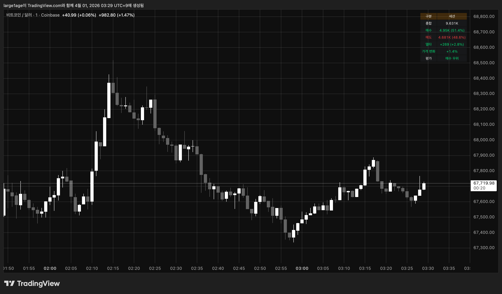
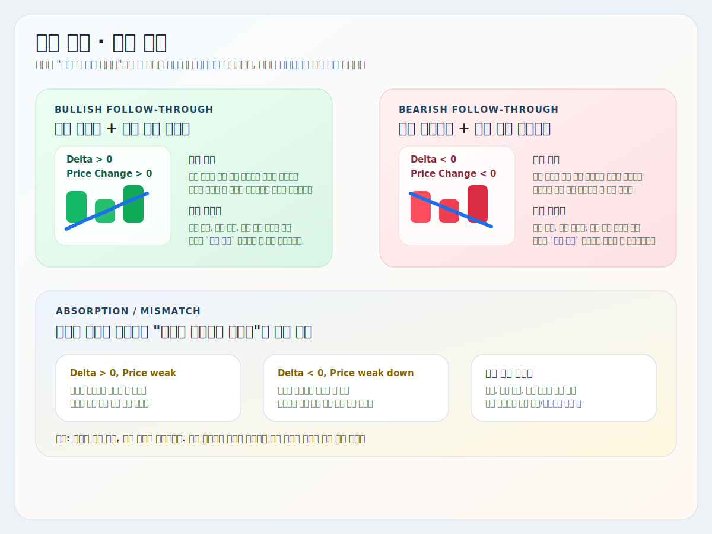
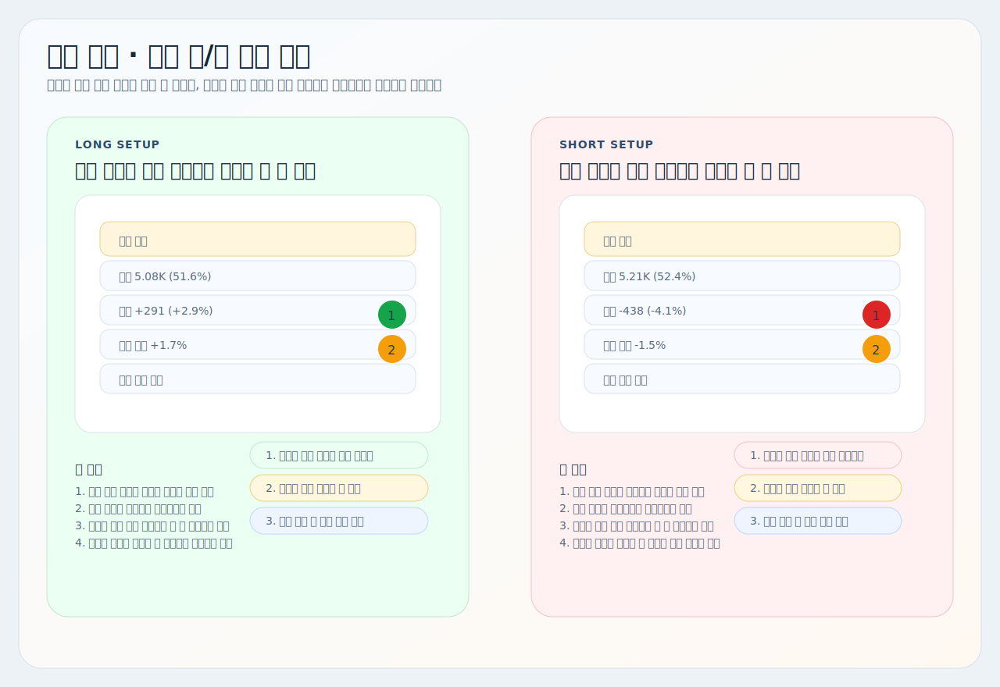

# Advanced-Volume-Delta

트레이딩뷰에서 사용할 수 있는 Pine Script 지표 설명서입니다.

대상 스크립트:
- [`volume-delta.pine`](./volume-delta.pine)

## 개요

이 지표는 차트 위에 직접 표시되는 `오버레이형 볼륨 델타 요약 박스`입니다.

사용자가 정한 집계 구간 안에서 아래 값을 한 번에 보여줍니다.

- `총합`
- `매수 총량`과 `비율`
- `매도 총량`과 `비율`
- `델타`
- `가격 변화율`
- `평가`

핵심 목적은 `같은 구간에서 누가 더 우세했고, 그 압력이 실제 가격 이동으로 이어졌는지`를 빠르게 압축해서 보는 것입니다.

## 사용 지표

이 스크립트는 아래 요소를 조합해서 볼륨 델타를 요약합니다.

- `Buy Volume / Sell Volume`
- `Volume Delta`
- `Price Change Ratio`
- `Session / Fixed-Bar Aggregation`

## 트레이딩뷰 적용 방법

1. 트레이딩뷰에서 `Pine Editor`를 엽니다.
2. [`volume-delta.pine`](./volume-delta.pine) 파일 전체를 복사합니다.
3. Pine Editor에 붙여넣습니다.
4. `차트에 추가`를 누릅니다.
5. 필요하면 저장합니다.

## 예시 화면

## 어떻게 읽는지

요약 박스의 각 항목은 아래 의미를 가집니다.

- `총합`: 집계 구간 전체 거래량
- `매수`: 추정 매수 거래량과 전체 대비 비율
- `매도`: 추정 매도 거래량과 전체 대비 비율
- `델타`: 매수 총량 - 매도 총량
- `가격 변화`: 같은 구간 시작가 대비 현재 가격 변화율
- `평가`: `델타`와 `가격 변화`를 합쳐 `강한 매수 우위`, `매수 우위`, `중립`, `매도 우위`, `강한 매도 우위`로 압축
- 모든 값은 `현재 진행 중인 봉`이 아니라 `완성된 봉` 기준으로 집계됩니다.

해석은 아래처럼 단순하게 보면 됩니다.

- `델타 플러스` + `가격 변화 플러스` = 매수 우세가 실제 상승으로 이어진 상태
- `델타 마이너스` + `가격 변화 마이너스` = 매도 우세가 실제 하락으로 이어진 상태
- `델타`와 `가격 변화` 방향이 어긋남 = 흡수, 분산, 반전 테스트 가능성
- `델타`가 큰데 `가격 변화`가 작음 = 한쪽 압력은 강한데 가격은 덜 움직인 상태
- `델타`가 작은데 `가격 변화`가 큼 = 상대적으로 적은 압력으로 가격이 민감하게 움직인 상태

## 기본 정보

- Pine Script 버전: `@version=6`
- 표시 위치: `overlay=true`
- 포맷: `format.volume`
- 지표명: `Advanced-Volume-Delta`

## 주요 기능

| 기능 | 핵심 의미 | 주요 설정 |
| --- | --- | --- |
| 집계 기준 선택 | `세션` 또는 `특정 봉 수` 기준으로 볼륨 델타를 집계합니다. | `집계 기준`, `봉 수` |
| 볼륨 델타 요약 | 같은 구간의 매수/매도 우세를 숫자로 확인합니다. | `볼륨 델타 요약 표시`, `표시 위치` |
| 가격 변화율 비교 | 델타 방향이 실제 가격 이동으로 이어졌는지 같이 봅니다. | 집계 구간과 동일한 기준 사용 |
| 평가 | 델타와 가격 변화 방향을 묶어 최종 방향감을 표시합니다. | 집계 구간과 동일한 기준 사용 |
| 배경 투명도 조절 | 헤더와 일반 필드 배경에 같은 투명도를 적용합니다. | `배경 투명도` |

짧게 보면:

- `매수/매도 비율`은 우세 방향
- `델타`는 압력 차이
- `가격 변화`는 결과
- `평가`는 최종 방향 결론
- `델타와 가격의 불일치`는 흡수 가능성

## 추천 사용 흐름

1. 먼저 `집계 기준`을 `세션` 또는 `특정 봉 수` 중 하나로 정합니다.
2. `매수/매도 비율`이 어느 쪽으로 기울었는지 봅니다.
3. `델타`가 같은 방향으로 커지는지 확인합니다.
4. `가격 변화`도 같은 방향인지 봅니다.
5. 마지막에 `평가`로 실제 매매 방향감을 빠르게 확인합니다.
6. 델타와 가격이 어긋나면 즉시 추종보다 `흡수`나 `함정` 가능성을 먼저 의심합니다.

예시:

- `매수 비율 우세 + 델타 플러스 + 가격 변화 플러스` = 롱 쪽 힘 확인
- `매도 비율 우세 + 델타 마이너스 + 가격 변화 마이너스` = 숏 쪽 힘 확인
- `델타 플러스인데 가격 변화 약함` = 위에서 받아내는 매도 흡수 가능성
- `델타 마이너스인데 가격 변화 약함` = 아래에서 받아내는 매수 흡수 가능성
- `델타 플러스 + 가격 변화 플러스 + 평가: 매수 우위` = 매수 압력이 실제 상승으로 이어지는 상태
- `델타 마이너스 + 가격 변화 마이너스 + 평가: 매도 우위` = 매도 압력이 실제 하락으로 이어지는 상태

## 세력 관점 해석

이 지표는 `누가 더 많이 쳤는가`보다, 그 압력이 실제 가격 이동으로 이어졌는지 아니면 반대편에서 흡수됐는지를 읽는 데 의미가 있습니다.

### 1. `델타 플러스 + 가격 변화 플러스`

이 구간은 매수 우위가 실제 상승으로 이어진 상태에 가깝습니다.

- 시장가 매수가 위 가격을 받아내고 있다는 뜻으로 볼 수 있습니다.
- `매수 비율 우세`, `델타 플러스`, `가격 변화 플러스`가 동시에 나오면 롱 쪽 힘을 더 단순하게 해석할 수 있습니다.
- `평가`까지 `매수 우위` 이상이면 당장 숫자를 세세하게 보지 않아도 방향 읽기가 쉬워집니다.

### 2. `델타 마이너스 + 가격 변화 마이너스`

이 구간은 매도 우위가 실제 하락으로 이어진 상태에 가깝습니다.

- 시장가 매도가 아래 가격을 밀어내고 있다는 뜻으로 볼 수 있습니다.
- `매도 비율 우세`, `델타 마이너스`, `가격 변화 마이너스`가 동시에 나오면 숏 쪽 힘을 더 쉽게 읽을 수 있습니다.
- `평가`가 `매도 우위` 이상이면 반등 기대보다 하단 진행 가능성을 먼저 봅니다.

### 3. `델타와 가격 변화가 어긋날 때`

이 구간은 `흡수`, `분산`, `함정 테스트` 후보입니다.

- `델타 플러스인데 가격이 약함`
  - 매수는 많았지만 가격이 기대만큼 못 오른 상태입니다.
  - 위에서 매도 물량이 받아내고 있거나, 분산이 진행 중일 수 있습니다.

- `델타 마이너스인데 가격이 약하게만 빠짐`
  - 매도는 많았지만 가격이 기대만큼 안 밀린 상태입니다.
  - 아래에서 매수 흡수나 바닥 방어가 들어오는 구간일 수 있습니다.

핵심은 이 어긋남을 `즉시 반대 진입 신호`로 보기보다, `후속 확인이 필요한 경고`로 보는 것입니다.

### 4. `평가`를 보는 이유

`평가`는 `매수/매도 비율`, `델타`, `가격 변화`를 한 줄로 압축한 값입니다.

- 숫자를 다 읽기 어렵거나 빠르게 판단해야 할 때 유용합니다.
- 다만 `평가` 하나만 믿기보다, 델타와 가격 변화가 왜 그렇게 나왔는지 같이 확인하는 편이 안전합니다.

### 5. 이 지표로 예측할 수 있는 움직임

- 델타와 가격 방향 일치: 후속 진행 가능성 증가
- 델타만 강하고 가격 반응 약함: 흡수 또는 분산 가능성 증가
- 가격만 크게 움직이고 델타 약함: 얇은 유동성 구간 또는 민감한 가격 반응 가능성
- 평가가 급변: 집계 구간 안 주도권 전환 가능성 증가

## 실전 롱/숏 전략 예시

### 롱 기준

- `롱 준비`: `매수 비율 우세`, `델타 플러스`, `가격 변화 플러스`가 먼저 나옵니다.
- `롱 매수`: `평가`가 `매수 우위` 이상으로 유지되고, 실제 가격 구조도 위쪽으로 버티는 걸 확인한 뒤 진입을 준비합니다.
- `롱 매도`: 델타가 둔화되거나 가격 변화가 더 이상 못 따라오는 자리에서 분할 청산을 생각합니다.
- `무효화`: 델타는 플러스인데 가격이 급하게 꺾이고 평가도 중립 아래로 약화되면 시나리오를 약화시킵니다.

### 숏 기준

- `숏 준비`: `매도 비율 우세`, `델타 마이너스`, `가격 변화 마이너스`가 먼저 나옵니다.
- `숏 매도`: `평가`가 `매도 우위` 이상으로 유지되고, 실제 가격 구조도 아래쪽으로 밀리는 걸 확인한 뒤 진입을 준비합니다.
- `숏 매수`: 델타가 둔화되거나 가격 변화가 더 이상 못 밀리는 자리에서 분할 청산을 생각합니다.
- `무효화`: 델타는 마이너스인데 가격이 바로 회복되고 평가도 중립 위로 약화되면 시나리오를 약화시킵니다.

### 이 지표를 쓸 때 중요한 점

- 이 지표는 `방향 확인기`이지, 단독 진입 신호기는 아닙니다.
- 가장 좋은 자리는 델타와 가격 변화가 같은 방향으로 유지되는 구간입니다.
- 숫자가 좋더라도 추세, 지지/저항, 캔들 구조가 반대면 우선순위를 낮추는 편이 더 안전합니다.

## 주의사항

- 이 지표는 실제 호가창 기준 `true delta`가 아니라 `봉 내부 종가 위치 기반` 추정치입니다.
- `평가`는 매수/매도 비율과 델타가 같은 방향 정보를 담기 때문에 이를 `주문 우위` 한 축으로 보고, 여기에 `가격 변화`를 더해 계산합니다.
- 현재 진행 중인 봉은 제외하고, 직전 `완성된 봉`까지의 데이터만 화면에 반영합니다.
- 그래서 자동 진입 신호라기보다 `압력 확인`, `흡수`, `불균형 해석` 용도로 쓰는 편이 좋습니다.
- 델타 숫자와 가격 변화율은 서로 다른 척도라서, 절대값 크기 비교보다 `방향 일치/불일치`를 우선 해석해야 합니다.
- 추세와 지지/저항, 가격 구조를 같이 보지 않으면 오해하기 쉽습니다.
