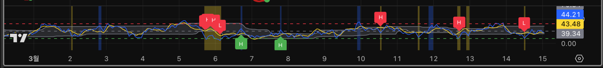
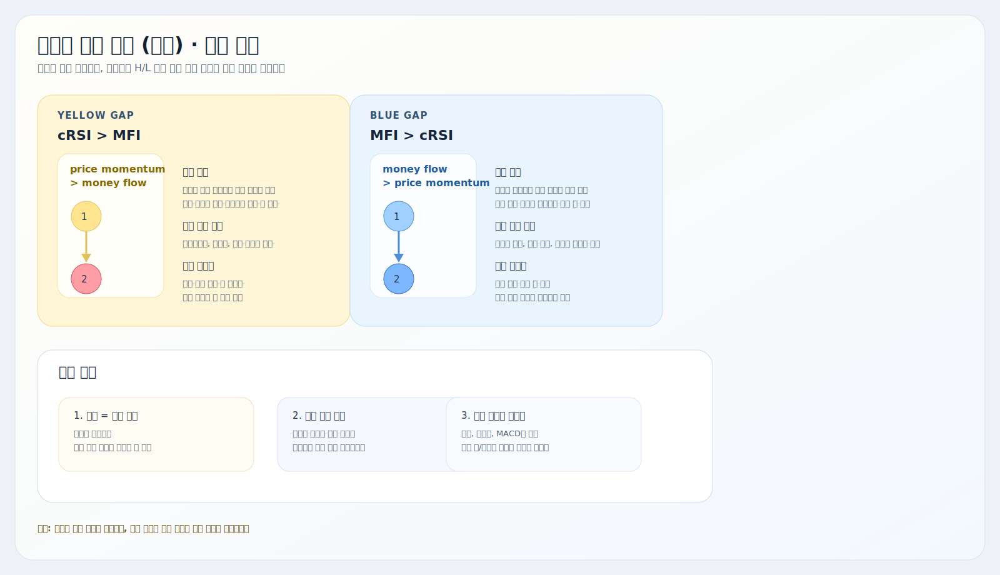
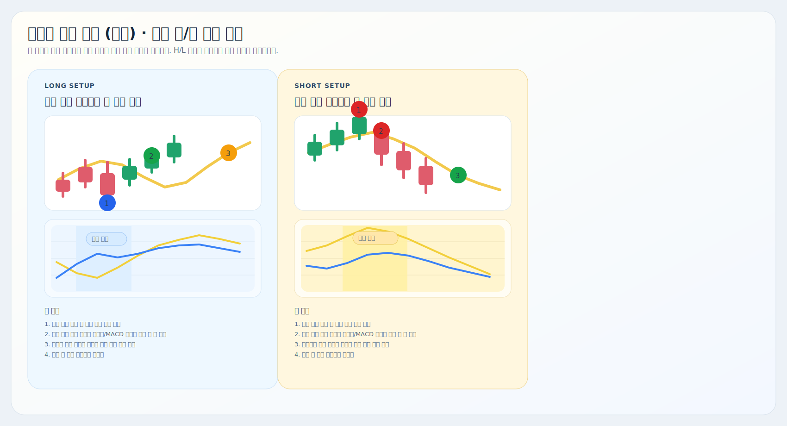

# 비정상 가격 추적 (보조)

트레이딩뷰용 Pine Script 보조지표 설명서입니다.

대상 스크립트:
- [`abnormal-price-tracker-helper.pine`](./abnormal-price-tracker-helper.pine)

이 지표는 `cRSI + MFI + 괴리 배경 + 반전 위험 라벨`을 한 패널에 모아서, 추격 구간과 반전 위험 구간을 마지막으로 거르는 보조 필터 역할을 합니다.

## 예시와 요약 이미지

## 핵심 구조

| 요소 | 현재 코드 기준 역할 |
| --- | --- |
| cRSI | 가격 모멘텀 축 |
| MFI | 자금 흐름 축 |
| 동적 밴드 | 최근 cRSI 분포 기반 극단 구간 |
| 괴리 배경 | `cRSI - MFI` 차이가 충분히 벌어졌는지 표시 |
| H / L 라벨 | 조건이 더 모였을 때만 뜨는 반전 위험 라벨 |

## 현재 로직

### 1. 배경 조건

배경은 단순히 괴리 방향만 먼저 보여줍니다.

- `cRSI > MFI`이고 차이가 `Gap Background Threshold` 이상이면 노란 계열 배경
- `MFI > cRSI`이고 차이가 `Gap Background Threshold` 이상이면 파란 계열 배경

즉 배경은 `경고 구간`입니다. 아직 반전 확정은 아닙니다.

### 2. 반전 위험 점수

현재 코드는 아래 요소를 합산해서 `Bearish / Bullish Reversal Risk`를 계산합니다.

- 괴리 배경 활성 여부
- 괴리 크기 `Weak / Strong Gap Threshold`
- 가격 연장 여부 `Price Stretch`
- 거래량 조건 `Volume Average Length`, `Volume Multiplier`
- cRSI 극단 구간 진입 여부
- 괴리 축소 또는 턴 조건
- cRSI 또는 MFI 턴 발생 여부

### 3. H / L 기준

현재 강도는 아래처럼 나뉩니다.

- `H`: 점수 `5` 이상
- `L`: 점수 `4`
- 그 아래: 라벨 없음

그리고 실제 라벨은 아래 조건까지 만족해야 뜹니다.

약세 위험:
- 노란 배경 유지
- 현재 봉 `양봉`
- 반대쪽 강한 bullish risk 없음
- `MFI > 20`

강세 위험:
- 파란 배경 유지
- 현재 봉 `음봉`
- 반대쪽 강한 bearish risk 없음
- `MFI < 80`

즉 `H / L`은 점수 결과이고, 최종 라벨은 `배경 + 봉 방향 + 필터`까지 통과해야 표시됩니다.

## 차트 읽는 법

| 상황 | 해석 |
| --- | --- |
| 노란 배경 | 가격 모멘텀이 자금 흐름보다 더 앞서 있음 |
| 파란 배경 | 자금 흐름 대비 가격이 더 눌려 있음 |
| 붉은색/주황색 `H/L` | 위에서 꺾일 위험 경고 |
| 파란색/녹색 `H/L` | 아래서 되돌릴 위험 경고 |

실전에서는 보통 이렇게 읽으면 됩니다.

- `노란 배경 + Bearish H`: 과열 뒤 조정 위험이 큼
- `파란 배경 + Bullish H`: 투매 뒤 반등 위험이 큼
- 배경만 있고 라벨 없음: 아직 조건이 덜 모인 상태

## 같이 쓰는 방법

1. [`비정상 가격 추적 (캔들)`](../비정상%20가격%20추적%20(캔들)/README.md)에서 자리와 진입 후보를 먼저 봅니다.
2. [`Auto VWAP`](../VWAP/README.md)으로 기준 단가 위치를 확인합니다.
3. [`거래량 압력 추적`](../거래량%20압력%20추적/README.md)과 [`MACD`](../MACD/README.md)로 압력과 모멘텀을 확인합니다.
4. 마지막으로 이 보조 지표에서 `반대 방향 H/L`이 뜨는지 확인합니다.

한 줄로 줄이면:

- 메인 신호는 진입 근거
- 보조 지표는 추격 금지 / 반대 위험 경고

## 자주 조정하는 설정

| 설정 | 언제 조정하나 |
| --- | --- |
| `Gap Background Threshold` | 배경이 너무 자주 또는 너무 드물게 켜질 때 |
| `Weak Gap Threshold`, `Strong Gap Threshold` | `H / L` 민감도를 조정할 때 |
| `Bearish Risk cRSI Zone`, `Bullish Risk cRSI Zone` | cRSI 극단 기준을 조정할 때 |
| `Volume Average Length`, `Volume Multiplier` | 거래량 필터를 더 엄격하게 할 때 |
| `Trend Length`, `Price Stretch (%)` | 가격 연장 기준을 더 빠르게/늦게 잡고 싶을 때 |
| `Use Gap Fade Condition` | 괴리 축소 조건을 사용할지 결정할 때 |
| `Gap Fade Lookback` | 괴리 둔화 확인 속도를 바꿀 때 |

## 해석 팁

- 이 지표는 `진입 신호기`보다 `반대 위험 필터`에 더 가깝습니다.
- `H`는 강한 경고이고, `L`은 초기 경고에 가깝습니다.
- 배경만 있는 구간은 아직 반전 타이밍보다 `과열/과매도 경고`에 더 가깝습니다.
- 메인 지표가 좋아도 반대 방향 `H`가 나오면 추격보다 관망이 자연스러운 경우가 많습니다.

## 주의사항

- 라벨은 확정봉 기준으로만 생성됩니다.
- cRSI와 MFI가 괴리되더라도 봉 방향, MFI 필터, 반대 강도 조건이 맞지 않으면 라벨이 안 뜹니다.
- 보조 지표 하나만으로 바로 반대 포지션을 잡기보다, 메인 지표와 가격 구조를 같이 보는 편이 안전합니다.
