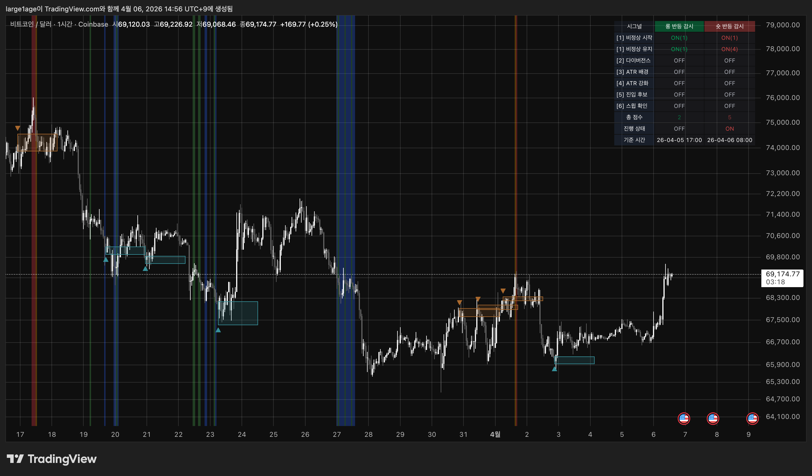
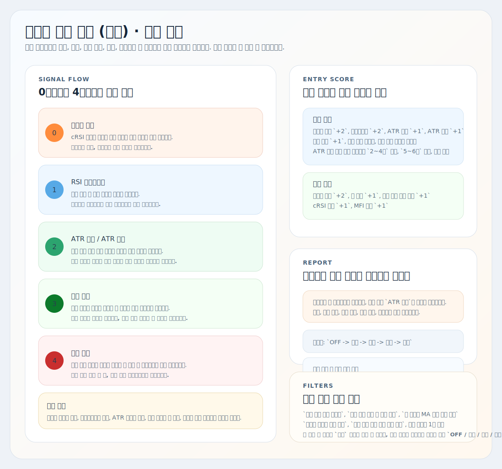
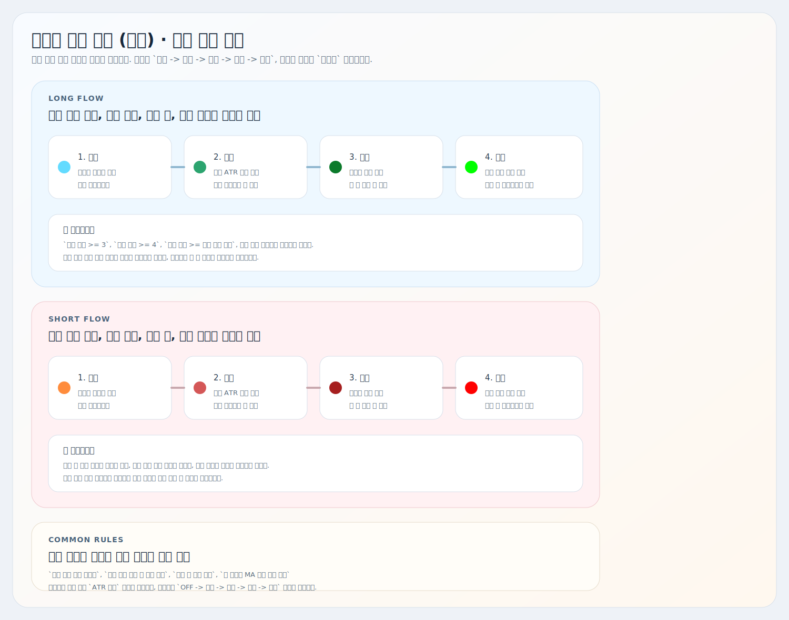

# 비정상 가격 추적 (캔들)

트레이딩뷰용 Pine Script 오버레이 지표 설명서입니다.

대상 스크립트:
- [`abnormal-price-tracker-candles.pine`](./abnormal-price-tracker-candles.pine)

이 지표는 `자리 -> 감시 -> 진입 후보 -> 스윕` 흐름을 한 장에서 읽기 위한 도구입니다. 모든 신호, 알림, 리포트 값은 `봉 마감 후 종가 확정` 기준으로만 갱신됩니다.

## 예시와 요약 이미지

## 핵심 흐름

| 단계 | 차트에서 보이는 것 | 현재 코드 기준 의미 |
| --- | --- | --- |
| 0단계 | 비정상 과매수/과매도 캔들 | cRSI 극단 + 볼린저 몸통 이탈로 자리 후보를 잡습니다. |
| 1단계 | RSI 다이버전스 삼각형 + 다이버전스 박스 | 피벗 확정 후 강세/약세 효율 저하를 힌트로 봅니다. |
| 2단계 | ATR 배경 / ATR 강화 배경 | 자리 이후 실제 후속 이동이 붙었는지 감시합니다. |
| 3단계 | 롱/숏 진입 후보 원 + 기준봉 박스 | 통합 점수와 필터를 통과한 첫 진입 후보입니다. |
| 4단계 | 스윕 봉 색상 + 다음 봉 다이아몬드 | `진입 후보` 박스를 실제로 스윕한 뒤 다음 봉 재확인까지 붙은 상태입니다. |

## 차트 요소

| 요소 | 현재 동작 |
| --- | --- |
| 비정상 캔들 | 과매수는 주황 계열, 과매도는 하늘 계열로 봉 색을 바꿉니다. |
| 다이버전스 | 강세/약세 다이버전스를 삼각형으로 표시하고, 옵션이 켜져 있으면 기준봉 존도 함께 그립니다. |
| ATR 배경 | 다이버전스 기준 또는 비정상 캔들 기준 이후 ATR 이동이 붙으면 배경이 켜집니다. |
| ATR 강화 | ATR 배경보다 더 큰 후속 이동이 확인되면 강한 배경 색으로 바뀝니다. |
| 진입 후보 | 롱/숏 통합 점수가 조건을 넘은 첫 봉에만 원형 시그널을 찍고 기준봉 박스를 만듭니다. |
| 스윕 | 진입 후보 박스를 실제로 쓸고 간 봉은 밝은 봉 색으로, 다음 봉 재확인은 다이아몬드로 표시합니다. |
| 리포트 | 롱/숏 이벤트 누적, 시간, 가격 변화, 포지션을 오른쪽 표로 보여줍니다. |

## 진입 후보 로직

### 1. 점수 구조

`진입 후보`는 `세팅 점수 + 확인 점수`를 합친 `통합 점수`로 계산합니다.

#### 세팅 점수

| 항목 | 기본 점수 |
| --- | --- |
| 최근 비정상 캔들 | `+2` |
| 최근 RSI 다이버전스 | `+2` |
| 현재 ATR 배경 | `+1` |
| 현재 ATR 강화 | `+1` |
| 최근 보조 신호 | `+1` |
| 최근 ATR 강화 근접 보너스 | `+2` 기본값 |
| 배경 근접 비정상 주문량 보너스 | `+2` 기본값 |
| ATR 강화 연속 눌림 보너스 | 가변값 |

`ATR 강화 연속 눌림 보너스`는 현재 코드에서 아래처럼 움직입니다.

- `ATR 강화`가 `최소 연속 봉 수` 이상 이어져야 후보가 됩니다.
- 롱은 `음봉 + 저가 갱신 + 눌림 깊이`, 숏은 `양봉 + 고가 갱신 + 반등 깊이`를 봅니다.
- 보너스는 `2~4봉` 구간에서 증가하고, `5~6봉`은 유지, `7봉 이상`은 감점됩니다.
- 같은 눌림 보너스는 한 번 실제 후보에 사용되면 소진됩니다.

#### 확인 점수

| 항목 | 기본 점수 |
| --- | --- |
| 거래량 확인 | `+2` |
| 봉 방향 일치 | `+1` |
| 직전 종가 대비 진행 | `+1` |
| cRSI 방향 일치 | `+1` |
| MFI 방향 일치 | `+1` |

### 2. 진입 후보 최소 조건

현재 코드는 아래를 모두 만족해야 `롱/숏 진입 후보`가 됩니다.

- `세팅 점수 >= 3`
- `확인 점수 >= 4`
- `통합 점수 >= 최소 진입 점수` 기본값 `8`
- 현재 방향 점수가 반대 방향 점수보다 큼
- `총 거래량 MA 미만 신호 차단` 조건 통과 시 현재 거래량이 총 거래량 평균 위
- `비정상 주문량 발생 필수` 사용 시 최근 비정상 주문량이 근처에 있어야 함
- 현재 봉에 반대 방향 `ATR 강화`가 켜져 있지 않아야 함

추가로 아래 필터가 켜져 있으면 함께 작동합니다.

- `이전 봉 배경 확인 필수`
- `반대 배경 전환 후 방향 전환`
- `동일 방향 신호 쿨다운`
- `강한 추세 연장 추가 진입 차단`

`포지션`의 `진입` 단계는 `통합 점수 >= max(최소 진입 점수, 진입 후보 점수)`일 때 올라갑니다. 기본값 기준으로는 `10점 이상`입니다.

## 스윕 로직

현재 스윕은 `다이버전스 박스`가 아니라 `진입 후보 박스`를 기준으로만 동작합니다.

### 진입 후보 박스

- 롱 박스: `저가 ~ 종가`
- 숏 박스: `고가 ~ 종가`

### 스윕 봉 조건

롱 쪽:
- 기존 롱 박스 하단을 `저가`로 이탈
- 현재 봉이 `음봉`
- `vpAbnormalVolume` 충족
- `sellVolume > buyVolume`

숏 쪽:
- 기존 숏 박스 상단을 `고가`로 이탈
- 현재 봉이 `양봉`
- `vpAbnormalVolume` 충족
- `buyVolume > sellVolume`

### 다음 봉 다이아몬드 조건

롱 쪽:
- 바로 다음 봉 `양봉`
- `buyVolume > sellVolume`
- `현재 봉 거래량 >= 이전 스윕 봉 거래량 * 스윕 확인 최소 거래량 비율`

숏 쪽:
- 바로 다음 봉 `음봉`
- `sellVolume > buyVolume`
- `현재 봉 거래량 >= 이전 스윕 봉 거래량 * 스윕 확인 최소 거래량 비율`

기본값은 `0.5`입니다.

## 리포트 읽는 법

리포트는 `시그널 | 롱 반등 감시 | 숏 반등 감시` 3열 구조입니다. 각 방향 리포트는 첫 이벤트가 들어오면 시작하고, `반대 방향 ATR 강화`가 나오면 종료됩니다.

### 리포트 항목

| 항목 | 의미 |
| --- | --- |
| 비정상 시작 | 비정상 과매수/과매도 시작 이벤트 누적 수 |
| 비정상 유지 | 비정상 캔들 유지 누적 수 |
| 다이버전스 | 강세/약세 다이버전스 누적 수 |
| ATR 배경 | 감시 배경 누적 수 |
| ATR 강화 | 강한 감시 배경 누적 수 |
| 진입 후보 | 실제 `3단계 진입 후보` 발생 누적 수 |
| 스윕 확인 | 실제 `4단계 스윕 확인` 누적 수 |
| 시작 시간 | 해당 방향 리포트의 첫 이벤트 시간 |
| 종료 시간 | 반대 방향 `ATR 강화`로 꺼진 시간 |
| 종가 변화 | 시작 봉 종가 대비 현재 또는 종료 종가 변화 |
| 최대 유리 | 시작 이후 가장 유리했던 고가/저가 기준 변화 |
| 최대 불리 | 시작 이후 가장 불리했던 고가/저가 기준 변화 |
| 포지션 | 현재 신호 기준 행동형 상태 + 내부 통합 점수 |

### 포지션

현재 코드에서 실제로 계산되는 포지션은 아래 다섯 가지입니다.

| 포지션 | 현재 기준 |
| --- | --- |
| OFF | 리포트 비활성 |
| 관찰 | 리포트는 살아 있지만 아직 후보 전 |
| 후보 | 현재 조건이 `진입 후보` 최소 기준 충족 |
| 진입 | 현재 조건이 강한 진입 기준 충족 |
| 스윕 | 같은 리포트 안에서 `스윕 확인` 발생 |

표시 예시는 아래처럼 읽으면 됩니다.

- `후보 (8)`: 현재 기준으로 첫 후보 구간이며 내부 통합 점수는 `8`
- `진입 (11)`: 강한 후보 기준까지 올라간 상태
- `스윕 (11)`: 스윕 확인까지 붙은 상태
- `OFF`: 해당 방향 리포트가 꺼졌거나 아직 시작되지 않음

리포트 표 아래 둘째 줄은 포지션 단계가 아니라, `점수 해석 구간`을 안내합니다.

- 현재 문구: `1~4점 약 / 5~7점 형성 / 8~9점 기준 / 10점+ 강화`
- 이 줄은 `관찰 / 후보 / 진입 / 스윕` 같은 포지션 단계가 아니라, 현재 점수 강도를 빠르게 읽는 참고선입니다.
- `8~9점`은 현재 코드에서 후보 최소 기준에 근접하거나 막 통과한 구간, `10점+`는 강한 진입 기준까지 올라온 구간으로 읽으면 됩니다.

참고:
- 표 아래 첫 줄 문구에는 `경계`가 포함되어 있지만, 현재 포지션 계산 함수가 실제로 반환하는 값은 `OFF / 관찰 / 후보 / 진입 / 스윕`입니다.

## 자주 조정하는 설정

| 설정 | 언제 조정하나 |
| --- | --- |
| `최소 진입 점수` | 후보 수를 늘리거나 줄일 때 |
| `진입 후보 점수` | `포지션 = 진입` 기준을 더 엄격하게 할 때 |
| `동일 방향 신호 쿨다운` | 같은 방향 후보 반복을 줄일 때 |
| `비정상 주문량 발생 필수` | 주문량 필터를 강하게 유지할지 결정할 때 |
| `총 거래량 MA 미만 신호 차단` | 한산한 봉 후보를 막고 싶을 때 |
| `ATR 강화 연속 최소 봉 수` | 눌림 보너스를 더 빨리/늦게 붙이고 싶을 때 |
| `눌림 최소 ATR 비율` | 눌림 깊이 기준을 조정할 때 |
| `강한 추세 연장 추가 진입 차단` | 추세 후반 후보 남발을 줄일 때 |
| `스윕 확인 최소 거래량 비율` | 다이아몬드 확인을 더 엄격하게 할 때 |
| `리포트 표시`, `리포트 표시 위치`, `리포트 글자 크기` | 리포트 가독성 조정 |
| `경량 렌더링 모드` | 차트 렌더링이 느릴 때 과거 박스 수와 박스 길이를 자동으로 줄일 때 |
| `경량 모드 최대 박스 수`, `경량 모드 최대 박스 길이` | 경량 모드에서 화면 객체를 더 줄이거나 조금 늘리고 싶을 때 |

## 해석 팁

- 비정상 캔들은 `반전 확정`이 아니라 `자리 경고`입니다.
- 다이버전스는 힌트이고, 실제 감시는 ATR 배경부터 시작됩니다.
- 진입 후보는 `점수 + 필터`를 모두 통과한 첫 봉만 찍히므로, 단순 색상 신호보다 해석 우선순위가 높습니다.
- 스윕은 점수 구간이 아니라 `진입 후보 이후 실제 유동성 확인` 단계입니다.
- 강한 추세가 너무 오래 이어질 때는 눌림 보너스가 뒤에서 감점되고, 추세 연장 필터가 같은 방향 추가 후보를 막을 수 있습니다.

## 주의사항

- 자동매매 전략이 아니라 해석 보조 지표입니다.
- 모든 신호는 `봉 마감 후 종가 확정` 기준입니다.
- 다이버전스는 피벗 확정 뒤에 표시되므로 지연이 있습니다.
- 스윕은 `vpAbnormalVolume` 조건까지 포함하므로, 단순 고가/저가 이탈만으로는 확인되지 않습니다.
- 과거 박스 유지 옵션을 켜면 예전 박스도 남지만, TradingView 오브젝트 한계 안에서 관리됩니다.
