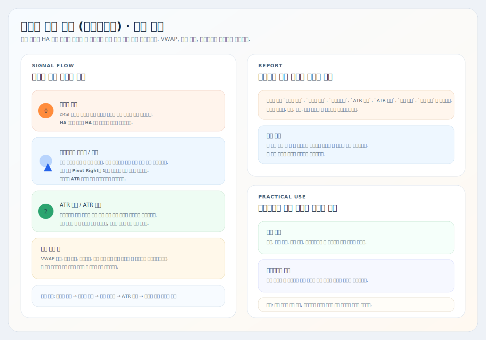
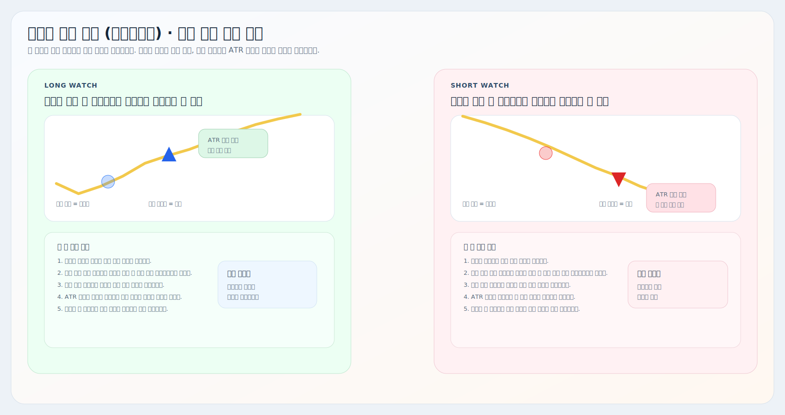

# 비정상 가격 추적 (하이칸아시)

트레이딩뷰용 Pine Script 오버레이 지표 설명서입니다.

대상 스크립트:
- [`abnormal-price-tracker-heikin-ashi.pine`](./abnormal-price-tracker-heikin-ashi.pine)

이 지표는 `하이킨아시 흐름으로 자리와 감시를 더 부드럽게 읽기` 위한 버전입니다. 현재 구조는 `비정상 캔들 -> 다이버전스 프리뷰/확정 -> ATR 배경 -> 리포트` 순서에 집중되어 있고, `VWAP`, `기준 발생`, `스윕확인` 로직은 포함하지 않습니다.

핵심은 `캔들 버전에서 보던 자리 해석을 HA 가격으로 한 번 더 걸러 보는 것`입니다. 즉 강한 자리 후보와 감시 흐름은 유지하되, 실행 신호를 많이 붙이기보다 `관찰 품질`을 높이는 쪽에 가깝습니다.

## 요약 이미지

## 현재 구조

| 요소 | 현재 코드 기준 역할 |
| --- | --- |
| 비정상 캔들 | cRSI 극단과 볼린저 몸통 이탈이 겹칠 때 자리 후보를 먼저 잡습니다. |
| 다이버전스 프리뷰 | 현재 봉 기준 잠재 다이버전스를 원형으로 먼저 보여줍니다. 더 빠르지만 더 민감합니다. |
| 다이버전스 확정 | 피벗 확정 뒤 삼각형으로 붙는 정식 신호입니다. 현재 기본 `Pivot Right`는 `1`입니다. |
| ATR 배경 | 다이버전스 또는 비정상 캔들 이후 실제 후속 이동이 붙었는지 감시합니다. |
| ATR 강화 | ATR 배경보다 더 강한 후속 이동이 붙은 상태입니다. |
| 리포트 | 롱/숏 감시 흐름과 시작/종료 시간을 간단하게 요약합니다. |

## 하이킨아시 버전에서 달라진 점

현재 하이킨아시 버전은 `캔들 버전의 실행 단계`를 일부러 비워 둔 상태입니다.

- `VWAP` 로직 없음
- `기준 발생` 없음
- `스윕확인` 없음
- 리포트는 `종료 시간`까지만 표시
- 리포트 종료는 `반대 방향에서 어떤 감시 시그널이든 1개 이상 나오면` 바로 종료

즉 지금 이 문서는 `진입 확정기`보다 `관찰 전용 흐름 정리`에 더 가깝습니다.

## 다이버전스 읽는 법

### 1. 프리뷰와 확정의 차이

| 표시 | 의미 |
| --- | --- |
| 연한 원형 | 아직 피벗이 완전히 확정되기 전의 잠재 다이버전스 |
| 진한 파랑/빨강 삼각형 | 피벗이 확정된 뒤 붙는 다이버전스 |

실전에서는 이렇게 읽으면 됩니다.

- `원형만 있음`: 아직 빠른 경고 단계
- `원형 뒤 삼각형 확정`: 실제 힌트로 채택
- `원형이 여러 번 보이지만 삼각형이 안 뜸`: 후보는 있었지만 확정 강도는 부족

### 2. 왜 하이킨아시에서 같이 보는가

하이킨아시 가격은 일반 캔들보다 흔들림이 덜해서:

- 추세 중간의 자잘한 노이즈를 줄여 보고 싶을 때
- 반전 힌트가 너무 자주 튀는 걸 완화하고 싶을 때
- 캔들 버전과 비교해서 `같은 자리인데 HA에서는 더 깔끔한가`를 확인하고 싶을 때

유용합니다.

주의할 점도 있습니다.

- 이 스크립트는 내부에서 별도 HA 시리즈를 만들지 않고 `현재 차트의 OHLC`를 그대로 씁니다.
- 그래서 `하이킨아시 차트`에 올려야 실제로 HA 기준으로 계산됩니다.

## ATR 배경과 감시

현재 ATR 배경은 두 경로에서 시작됩니다.

- 다이버전스 이후 후속 이동
- 비정상 캔들 이후 후속 이동

강한 배경은 일반 ATR 배경보다 더 큰 이동이 붙었을 때 켜집니다.

짧게 보면:

- `비정상 캔들`: 자리
- `다이버전스 확정`: 힌트
- `ATR 배경`: 감시 시작
- `ATR 강화`: 감시 강화

## 리포트 읽는 법

현재 리포트는 `시그널 | 롱 반등 감시 | 숏 반등 감시` 3열 구조입니다.

표에 남는 항목은 아래 7개입니다.

| 항목 | 의미 |
| --- | --- |
| 비정상 시작 | 비정상 과매수/과매도 시작 누적 |
| 비정상 유지 | 비정상 캔들 유지 누적 |
| 다이버전스 | 확정 다이버전스 누적 |
| ATR 배경 | 감시 배경 누적 |
| ATR 강화 | 강한 감시 배경 누적 |
| 시작 시간 | 첫 이벤트가 들어온 시간 |
| 종료 시간 | 반대 방향 감시 흐름이 먼저 들어와 종료된 시간 |

현재 종료 방식은 단순합니다.

- 롱 감시 중 `숏 쪽 이벤트가 하나라도 나오면` 롱 감시는 종료
- 숏 감시 중 `롱 쪽 이벤트가 하나라도 나오면` 숏 감시는 종료

즉 예전처럼 기준봉/스윕 상태를 오래 들고 가는 방식이 아니라, `현재 어느 방향 감시가 더 살아 있는가`만 빠르게 보는 테이블입니다.

## 같이 쓰는 방법

1. [`비정상 가격 추적 (캔들)`](../비정상%20가격%20추적%20(캔들)/README.md)에서 원본 캔들 기준 자리와 실행 구조를 먼저 봅니다.
2. 이 하이킨아시 버전으로 같은 구간이 HA 기준으로도 여전히 깔끔한지 확인합니다.
3. [`Auto VWAP`](../VWAP/README.md)으로 기준 단가 위/아래 위치를 따로 확인합니다.
4. [`거래량 압력 추적`](../거래량%20압력%20추적/README.md), [`MACD 다이버전스 추적`](../MACD/README.md)으로 힘 재개를 마지막에 확인합니다.

한 줄로 줄이면:

- `캔들 버전`은 구조와 실행
- `하이킨아시 버전`은 노이즈를 줄인 감시

## 자주 조정하는 설정

| 설정 | 언제 조정하나 |
| --- | --- |
| `Pivot Right` | 다이버전스 확정 속도를 빠르게 또는 느리게 보고 싶을 때 |
| `Pivot Left` | 피벗 민감도를 조정하고 싶을 때 |
| `최대/최소 탐색 범위` | 이전 피벗 비교 범위를 바꾸고 싶을 때 |
| `ATR 기간`, `ATR 과도 이동 배수` | 감시 배경이 너무 빨리/늦게 붙을 때 |
| `강한 배경 판정 ATR 배수` | ATR 강화 배경을 더 엄격하게 볼 때 |
| `배경 투명도` | 차트 가독성에 맞게 배경을 더 옅게 또는 진하게 보고 싶을 때 |
| `리포트 표시`, `리포트 위치`, `리포트 글자 크기` | 감시 표 가독성을 조정할 때 |

## 해석 팁

- 프리뷰 원형은 `먼저 보기`, 확정 삼각형은 `채택하기`로 역할을 나누면 편합니다.
- 하이킨아시 버전은 기준봉/스윕이 없으므로, 이 지표 하나만으로 실행을 끝내기보다 `캔들 버전`과 같이 보는 편이 좋습니다.
- ATR 배경이 켜졌다고 바로 진입하기보다, 반대편 감시가 바로 생기는지 같이 보면 무리한 추격을 줄일 수 있습니다.

## 주의사항

- 이 지표는 현재 `관찰 중심` 버전입니다.
- 프리뷰 다이버전스는 확정보다 빠른 대신 더 민감하고, 확정 없이 끝날 수 있습니다.
- 확정 다이버전스와 리포트 이벤트는 기본적으로 `봉 마감 후` 업데이트됩니다.
- HA 계산을 원하면 반드시 `하이킨아시 차트`에 올려야 합니다.
