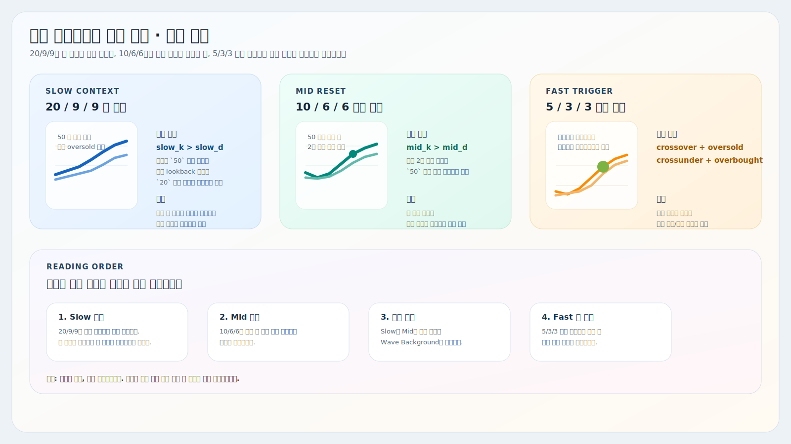
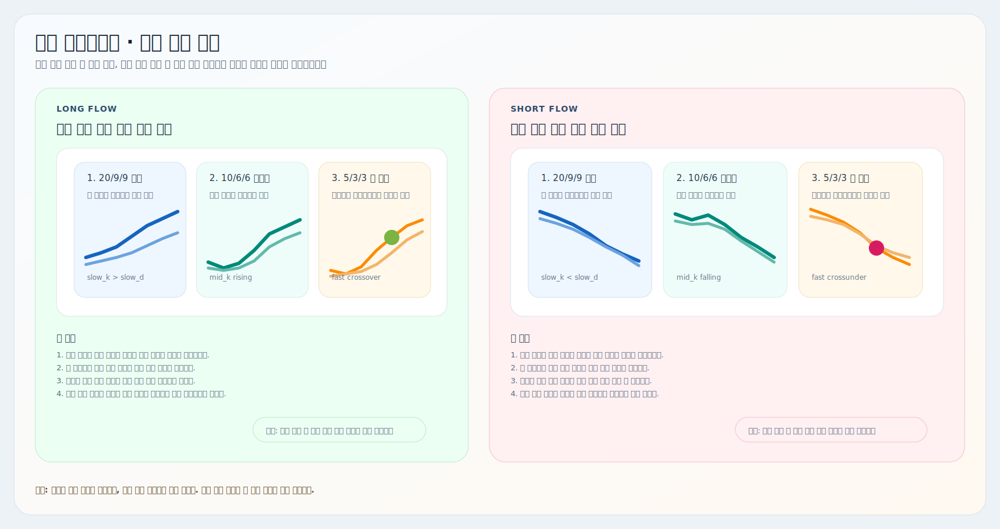

# 삼중 스토캐스틱 파동 추적

트레이딩뷰용 Pine Script 보조지표 설명서입니다.

대상 스크립트:
- [`triple-stochastic-wave.pine`](./triple-stochastic-wave.pine)

이 지표는 `5/3/3`, `10/6/6`, `20/9/9` 3개의 스토캐스틱을 한 화면에 놓고, `큰 방향 -> 중간 조정 -> 단기 타점` 순서로 읽기 쉽게 만든 버전입니다. 핵심은 `20/9/9`로 큰 흐름을 먼저 정하고, `10/6/6`으로 조정 종료 여부를 본 뒤, `5/3/3` 원형 표시로 실제 단기 트리거를 확인하는 데 있습니다.

## 예시와 요약 이미지

## 핵심 구조

| 요소 | 현재 코드 기준 역할 |
| --- | --- |
| Slow `%K/%D` (`20/9/9`) | 큰 방향과 파동 컨텍스트를 봅니다. |
| Mid `%K/%D` (`10/6/6`) | 중간 조정이 끝나고 다시 원래 방향으로 붙는지 봅니다. |
| Fast `%K/%D` (`5/3/3`) | 실제 단기 진입 타점 후보를 봅니다. |
| `Bull Wave Background` | 큰 상승 파동과 중간 상승 재가동이 동시에 맞는 구간을 배경으로 표시합니다. |
| `Bear Wave Background` | 큰 하락 파동과 중간 하락 재개가 동시에 맞는 구간을 배경으로 표시합니다. |
| `Fast Bull/Bear Cross` 원 | `5/3/3`이 과매도/과매수 구간에서 크로스할 때만 단기 트리거를 표시합니다. |

## 현재 로직

### 1. 기본 계산

각 스토캐스틱은 아래 순서로 계산합니다.

- 최근 `length` 구간의 고가/저가 범위 계산
- 현재 종가를 그 범위 안에서 `%K`로 환산
- `%K`를 한 번 평균해서 부드럽게 만들고
- 그 `%K`를 다시 평균해서 `%D` 생성

즉 각 선은 일반적인 스토캐스틱 구조를 유지하되, 길이와 smoothing만 다르게 가져갑니다.

### 2. 큰 파동 조건

상승 큰 파동:
- `slow_k > slow_d`
- 그리고 `slow_k >= 50` 이거나
- 최근 `Slow Context Lookback` 안에서 `slow_k`가 `Oversold` 이하까지 눌린 적이 있음

하락 큰 파동:
- `slow_k < slow_d`
- 그리고 `slow_k <= 50` 이거나
- 최근 `Slow Context Lookback` 안에서 `slow_k`가 `Overbought` 이상까지 반등한 적이 있음

즉 `20/9/9`는 `지금 큰 물결이 어느 쪽인지`를 정하는 기준입니다.

### 3. 중간 파동 조건

상승 재가동:
- `mid_k > mid_d`
- `mid_k`가 최근 2봉 연속 상승
- 최근 `Mid Pullback Lookback` 안에서 `mid_k`가 `50` 이하까지 눌린 적이 있음

하락 재개:
- `mid_k < mid_d`
- `mid_k`가 최근 2봉 연속 하락
- 최근 `Mid Pullback Lookback` 안에서 `mid_k`가 `50` 이상까지 반등한 적이 있음

즉 `10/6/6`은 `중간 조정이 끝났는지`를 보는 필터입니다.

### 4. 단기 타점 조건

상승 트리거:
- `5/3/3`이 골든크로스
- 그리고 크로스 시점 값이 `Oversold` 이하

하락 트리거:
- `5/3/3`이 데드크로스
- 그리고 크로스 시점 값이 `Overbought` 이상

현재 코드에서 원형 표시는 이 조건이 맞을 때만 나옵니다. 즉 `모든 크로스`를 찍는 게 아니라, `과매도/과매수 구간에서 나온 크로스`만 보여 주는 구조입니다.

### 5. 배경과 얼럿

배경 조건:
- 초록 배경 = `큰 상승 파동` + `중간 상승 재가동`
- 빨강 배경 = `큰 하락 파동` + `중간 하락 재개`

얼럿 조건:
- `Triple Stochastic Bull Alignment`
- `Triple Stochastic Bear Alignment`

현재 얼럿은 원형 트리거가 아니라 `fast / mid / slow` 3개가 모두 같은 방향으로 정렬됐을 때만 동작합니다.

## 차트 읽는 법

| 상황 | 해석 |
| --- | --- |
| `20/9/9`만 상승 | 큰 흐름은 위지만 아직 중간 조정 종료 확인은 부족할 수 있습니다. |
| 초록 배경 | 큰 상승 파동과 중간 상승 재가동이 동시에 맞는 상태입니다. |
| 빨강 배경 | 큰 하락 파동과 중간 하락 재개가 동시에 맞는 상태입니다. |
| 초록 원 | `5/3/3`이 과매도권에서 위로 꺾이는 단기 트리거입니다. |
| 분홍 원 | `5/3/3`이 과매수권에서 아래로 꺾이는 단기 트리거입니다. |
| 배경은 있는데 원이 없음 | 방향 구조는 맞지만 단기 타이밍은 아직 안 나온 상태입니다. |

실전에서는 보통 이렇게 읽으면 됩니다.

- `초록 배경 + 초록 원`: 큰 상승파 안에서 단기 눌림 타점 후보
- `빨강 배경 + 분홍 원`: 큰 하락파 안에서 단기 반등 종료 후보
- `배경 없이 원만 표시`: 단기 흔들림일 가능성이 있으므로 한 번 더 확인

## 자주 조정하는 설정

| 설정 | 언제 조정하나 |
| --- | --- |
| `Fast / Mid / Slow Length` | 종목 변동성이나 타임프레임에 맞춰 반응 속도를 바꾸고 싶을 때 |
| `Oversold`, `Overbought` | 트리거 원이 너무 자주 뜨거나 너무 드물 때 |
| `Trend Midline` | 큰 파동 기준 중심값을 `50`이 아닌 다른 값으로 보고 싶을 때 |
| `Slow Context Lookback` | 큰 파동의 눌림/반등 인정 구간을 넓히거나 줄일 때 |
| `Mid Pullback Lookback` | 중간 조정을 더 엄격하게 또는 더 느슨하게 보고 싶을 때 |
| `모습 탭의 선/배경 스타일` | 선 색상, 굵기, 배경 투명도, 원형 표시 가독성을 조정하고 싶을 때 |

## 같이 쓰는 방법

1. [`비정상 가격 추적 (캔들)`](../비정상%20가격%20추적%20(캔들)/README.md)에서 자리와 진입 후보를 먼저 봅니다.
2. [`Auto VWAP`](../VWAP/README.md)으로 현재 가격이 기준 단가 위인지 아래인지 확인합니다.
3. 이 삼중 스토캐스틱으로 `큰 방향 -> 중간 조정 종료 -> 단기 타점`이 같은 방향인지 봅니다.
4. [`거래량 압력 추적`](../거래량%20압력%20추적/README.md)이나 [`MACD 다이버전스 추적`](../MACD/README.md)으로 실제 힘이 붙는지 마지막 확인을 합니다.

한 줄로 줄이면:

- `VWAP`은 기준 단가
- `삼중 스토캐스틱`은 파동 정렬과 타점
- `거래량 / MACD`는 실제 힘 확인

## 해석 팁

- 이 지표는 `배경으로 구조`, `원으로 타이밍`을 보는 보조지표에 가깝습니다.
- 초록/빨강 배경이 있다고 바로 진입하기보다, 원형 트리거가 실제로 붙는지 기다리는 편이 안정적입니다.
- `5/3/3`은 반응이 빠른 만큼 횡보장에서 흔들림이 많습니다.
- `20/9/9`와 `10/6/6`이 맞지 않으면, `5/3/3` 신호는 단기 반등/반락일 가능성이 큽니다.
- 배경 투명도와 원 크기는 `모습` 탭에서 시인성에 맞게 조절하는 편이 좋습니다.

## 주의사항

- 이 지표는 전략이 아니라 보조지표입니다. 손절/익절까지 자동으로 정하지는 않습니다.
- 원형 트리거는 과매도/과매수 조건이 같이 붙을 때만 표시됩니다.
- 강한 추세장에서는 스토캐스틱이 과매수/과매도 구간에 오래 머무를 수 있습니다.
- 횡보장에서는 `5/3/3` 신호가 자주 흔들릴 수 있으므로 가격 구조와 거래량을 같이 보는 편이 안전합니다.
